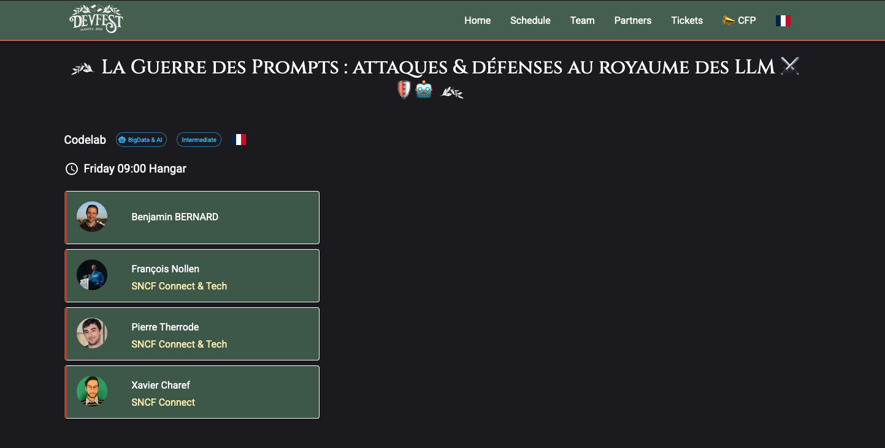

# [DevFest 2025] La Guerre des Prompts : attaques & défenses au royaume des LLM ⚔️🛡️🤖

🚧 🇬🇧 🚧 English version available [here](https://github.com/pi-2r/devfest2025-La-Guerre-des-Prompts-attaques-et-defenses-au-royaume-des-LLM/tree/english-version) 🚧 🇬🇧 🚧

Ce projet github est issue du workshop fait par [Benjamin Bernard](https://www.linkedin.com/in/benvii/), [Xavier Charef](https://www.linkedin.com/in/xavier-charef-6b843497/), [François Nollen](https://www.linkedin.com/in/francois-nollen/) et [Pierre Therrode](https://www.linkedin.com/in/ptherrode/), pour le Devfest 2025, avec comme sujet : [La Guerre des Prompts : attaques & défenses au royaume des LLM ⚔️🛡️🤖](https://devfest2025.gdgnantes.com/en/sessions/la_guerre_des_prompts___attaques___defenses_au_royaume_des_llm________)

## Info réseau

Point d'accès wifi :
* SSID: LLM_ATTACK
* Mot de passe: password

Lab AI Red Team partagé disponible ici : http://192.168.20.2:5000/login?auth=YOUR_AUTH_KEY

Instance partagée de Tock disponible ici : http://192.168.20.2/

*Comptes utilisés pour l'instance partagée (vous avez un petite papier), sinon [liste ici](https://docs.google.com/spreadsheets/d/1dUkbyRc33teEPK-bCrGTdLKIvyPblk4PbxfZXNg2VFA/edit?usp=sharing).*

## Sommaire

  
🚧 💡 🚧 note sur La section “Introduction aux menaces de l’IA générative” 🚧 💡 🚧

    
La section “**Introduction aux menaces de l’IA générative**” vise avant tout à donner des repères pour comprendre les enjeux
et prendre du recul sur le sujet, avant de se lancer pleinnement dans la pratique ("**Comprendre les Principes du Prompt Injection et leurs Impacts**"). 

Lors du codelab, cette introduction sera présentée sous forme de diaporama (environ 10min). Cela permettra à chacun de 
préparer sereinement sa machine tout en se familiarisant progressivement avec la thématique abordée.

### Introduction aux menaces de l'IA générative (10 min)
 
- [1 - Il était une fois dans un monde numérique...](step_1.md)
- [2 - Pourquoi la sécurité des LLM est-elle cruciale ?](step_2.md)
- [3 - Des écarts sous contrôle relatif](step_3.md)
- [4 - Cadres de sécurité référents](step_4.md)

### Comprendre les principes du prompt injection (30 min)
 
- [5 - Introduction au playground et objectifs](step_5.md)
- [6 - Techniques d'attaque par prompt injection](step_6.md)
- [7 - Impacts réels et scénarios d'exploitation](step_7.md)

### Test de robustesse (40 min)

- [8 - Test de robustesse ?](step_8.md)
- [9 - Garak: A Framework for Security Probing Large Language Models](step_9.md)
- [10 - PyRIT: Framework for Security Risk Identification and Red Teaming in Generative AI System](step_10.md)

### Contre-mesures et stratégies de défense (35 min)

- [11 - Mettre en place notre chatbot avec la solution Tock](step_11.md)
- [12 - Mettre en place les premieres contre-mesures avec FastAPI](step_12.md)
- [13 - Mettre en place NeMo Guardrails](step_13.md)

### [BONUS] Évaluation et amélioration de la robustesse

 - [14 - AI Red Teaming](step_14.md)
 - [15 - Benchmarking avec Promptfoo](step15.md)

### [CONCLUSION] Pour aller plus loin (5 min)

- [Remerciements](thanks-you.md)
- [En savoir plus / ressources](resources.md)
