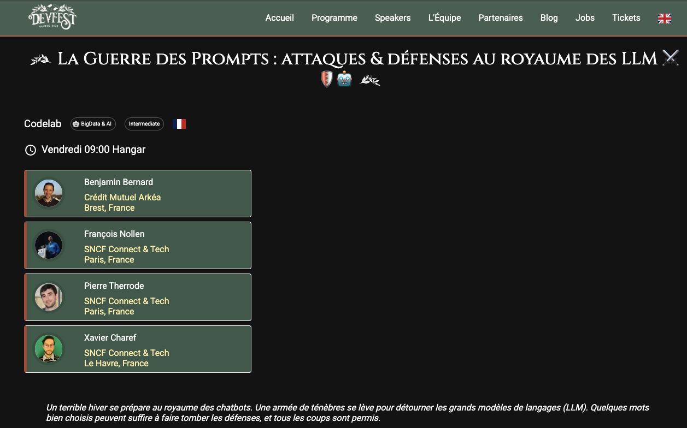

# [DevFest 2025] The Prompt War: Attacks & Defenses in the Realm of LLMs ⚔️🛡️🤖

This GitHub project stems from the workshop by [Benjamin Bernard](https://www.linkedin.com/in/benvii/), [Xavier Charef](https://www.linkedin.com/in/xavier-charef-6b843497/), [François Nollen](https://www.linkedin.com/in/francois-nollen/), and [Pierre Therrode](https://www.linkedin.com/in/ptherrode/), for DevFest 2025, on the topic: [The Prompt War: Attacks & Defenses in the Realm of LLMs ⚔️🛡️🤖](https://devfest2025.gdgnantes.com/en/sessions/la_guerre_des_prompts___attaques___defenses_au_royaume_des_llm________)

## Network Info

Wi-Fi Access Point:
* SSID: LLM_ATTACK
* Password: password

Shared AI Red Team Lab available here: [http://192.168.20.2:5000/login?auth=YOUR_AUTH_KEY](http://192.168.20.2:5000/login?auth=YOUR_AUTH_KEY)

Shared Tock instance available here: http://192.168.20.2/

## Table of contents

  
🚧 💡 🚧 Note on the section “Introduction to Generative AI Threats†🚧 💡 🚧

The section “**Introduction to Generative AI Threats**” primarily aims to provide frameworks to understand the stakes and gain perspective on the topic before fully engaging in practice ("**Understanding the Principles of Prompt Injection and Their Impacts**").

During the codelab, this introduction will be presented as a slideshow (around 10 minutes). This allows everyone to prepare their machine calmly while gradually familiarizing themselves with the subject.

### Introduction to generative AI threats (10 min)

- [1 - Once Upon a Time in a digital world...](step_1.md)
- [2 - Why is LLM security crucial?](step_2.md)
- [3 - Controlled deviations](step_3.md)
- [4 - Reference security frameworks](step_4.md)

### Understanding the principles of prompt injection (30 min)

- [5 - Introduction to the playground and objectives](step_5.md)
- [6 - Prompt Injection attack techniques](step_6.md)
- [7 - Real Impacts and exploitation scenarios](step_7.md)

### Robustness testing (40 min)

- [8 - What is robustness testing?](step_8.md)
- [9 - Garak: A Framework for Security Probing Large Language Models](step_9.md)
- [10 - PyRIT: Framework for Security Risk Identification and Red Teaming in Generative AI Systems](step_10.md)

### Countermeasures and defense strategies (35 min)

- [11 - Setting up our chatbot with the Tock solution](step_11.md)
- [12 - Implementing initial countermeasures with FastAPI](step_12.md)
- [13 - Implementing NeMo Guardrails](step_13.md)

### [BONUS] Evaluation and improvement of robustness

- [14 - AI Red Teaming](step_14.md)
- [15 - Benchmarking with Promptfoo](step15.md)

### [CONCLUSION] Going further (5 min)

- [Acknowledgments](thanks-you.md)
- [Learn more / Resources](resources.md)  
