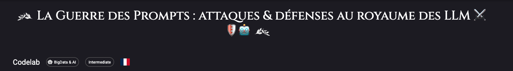
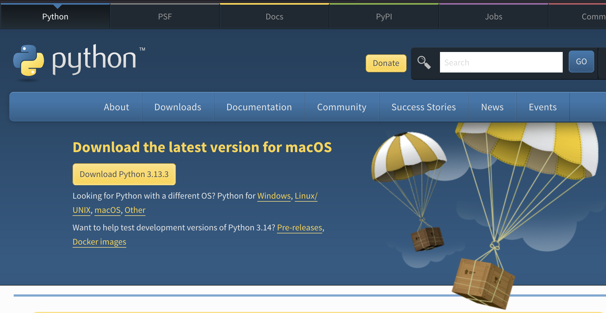
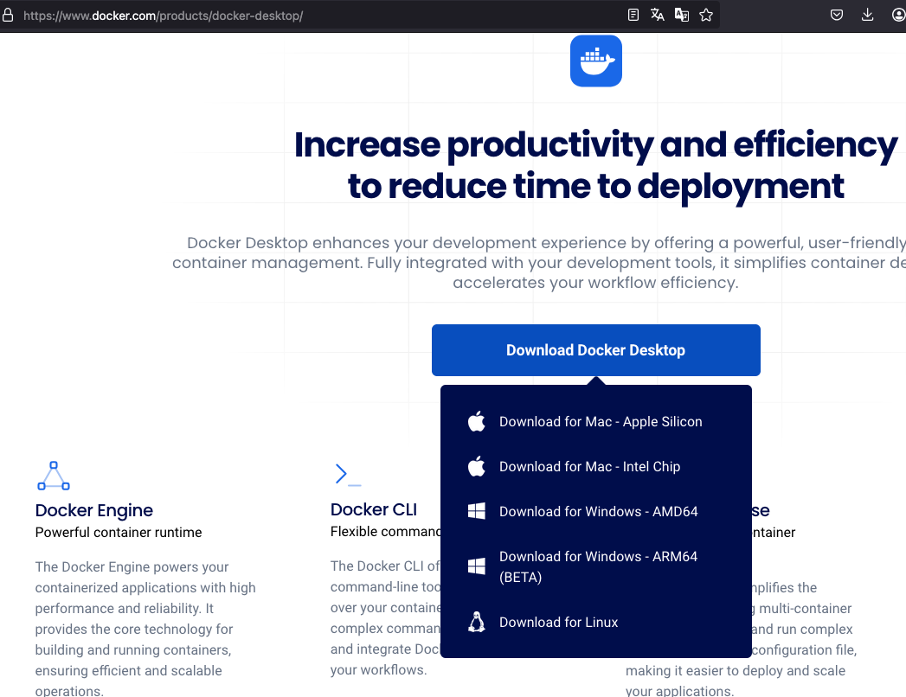
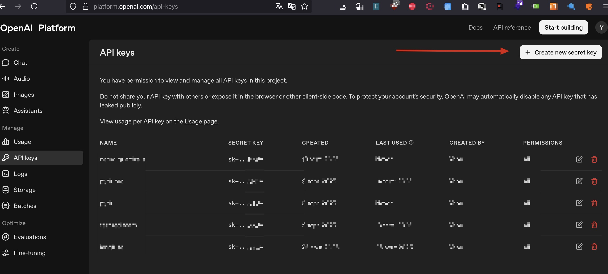
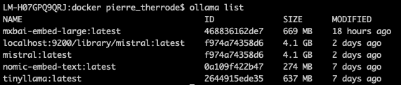
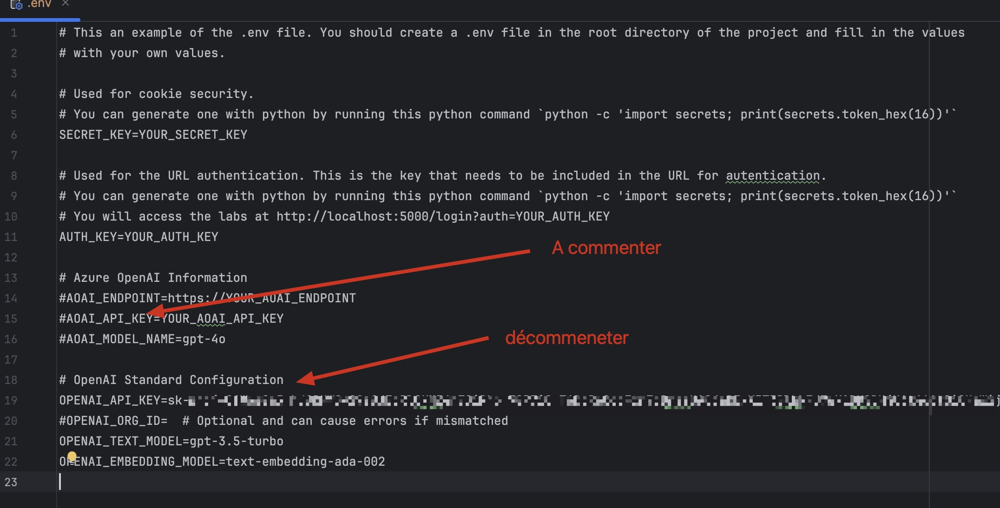
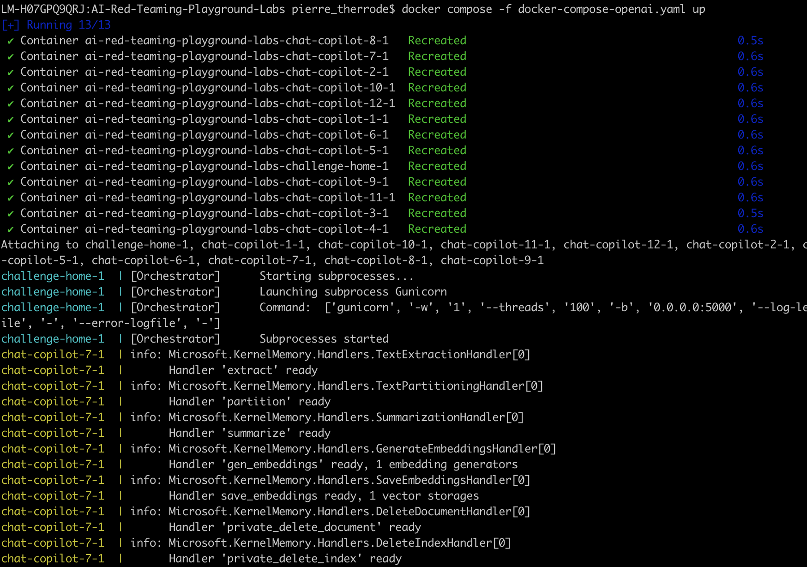
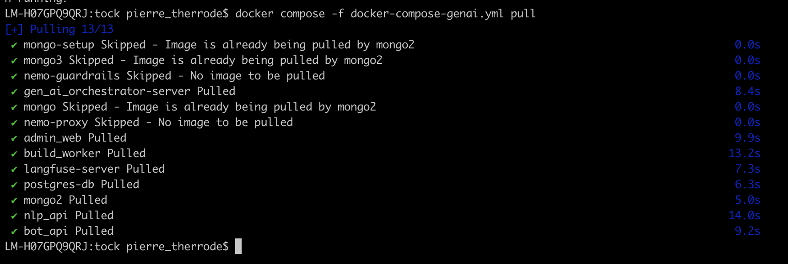
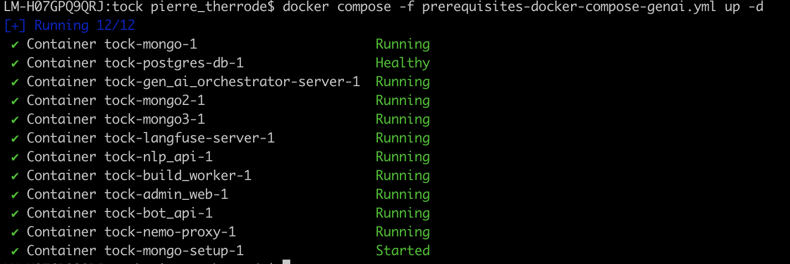

[](https://devfest2025.gdgnantes.com/en/sessions/la_guerre_des_prompts___attaques___defenses_au_royaume_des_llm________)

Ce tutorial est proposé en amont de la session [La Guerre des Prompts : attaques & défenses au royaume des LLM ⚔️🛡️🤖](https://devfest2025.gdgnantes.com/en/sessions/la_guerre_des_prompts___attaques___defenses_au_royaume_des_llm________) à Devfest Nantes 2025.


## Sommaire

- [Codelab](#codelab)
  - [Récupérer l'atelier](#récupérer-latelier)
  - [Python](#python)
  - [L'outil Docker](#loutil-docker)


- [OpenAi](#openai)
  - [Récupérer une clé OpenAi](#récupérer-une-clé-openai)


- [Ollama](#ollama)
  - [L'outil Ollama](#loutil-ollama)
  - [Les modèles Ollama](#les-modèles-ollama)


- [Les images Docker](#les-images-docker)
  - [AI Red Teaming Playground Labs](#ai-red-teaming-playground-labs)
  - [Nemo Guardrails](#nemo-guardrails)
  - [Tock](#tock)


- [Installation des outils de tests de robustesse](#installation-des-outils-de-tests-de-robustesse)
  - [Installation de Garak](#installation-de-garak)
  - [Installation de PyRIT](#installation-de-pyrit)
  - [Installation de Promptfoo](#installation-de-promptfoo)


    
### Récupérer l'atelier

Depuis votre terminal, récupérez le projet en clonant le dépôt :
  ```bash
  git clone git@github.com:pi-2r/devfest2025-La-Guerre-des-Prompts-attaques-et-defenses-au-royaume-des-LLM.git
  ```
  
Vous pouvez également télécharger l’archive .zip du projet, puis la décompresser sur votre machine : https://github.com/pi-2r/devfest2025-La-Guerre-des-Prompts-attaques-et-defenses-au-royaume-des-LLM/archive/refs/heads/main.zip

### Python

Installer Python 3.10 ou supérieur sur votre machine: https://www.python.org/downloads/



### L'outil Docker

Assurez-vous d’avoir installé  [Docker Desktop](https://www.docker.com/products/docker-desktop/) sur votre machine.



### Récupérer une clé OpenAi
Allez sur https://platform.openai.com/signup pour créer un compte et récupérer une clé API. Dés que vous etes connecté, 
allez dans la section [API Keys](https://platform.openai.com/api-keys) pour créer une nouvelle clé. Vous devrez avoir cette page :



Puis cliquez sur le bouton **Create new secret key** pour générer une nouvelle clé au moment voulu dans le lab.


### L'outil Ollama

Commencez par installer [Ollama](https://ollama.com/download) sur votre machine.


### Les modèles Ollama

Pour préparer l’atelier, installez les modèles principaux en exécutant les commandes suivantes dans votre terminal :
```bash
ollama pull tinyllama
ollama pull mistral
ollama pull nomic-embed-text
```

Afin de confirmer que les modèles ont bien été téléchargés, lancez la commande :
```bash
 ollama list
 ```

Vous devriez obtenir un affichage similaire à l’exemple suivant :




### Les images Docker

### AI Red Teaming Playground Labs

Depuis votre terminal, placez-vous dans le dossier où vous souhaitez installer le projet, par exemple **Documents**,
puis exécutez la commande suivante pour cloner le dépôt et entrer automatiquement dans le dossier créé :

```bash
git clone https://github.com/microsoft/AI-Red-Teaming-Playground-Labs.git && cd AI-Red-Teaming-Playground-Labs
```

Renommez le fichier **.env.example** en **.env**, puis commentez toutes les variables relatives à Microsoft OpenAI et
décommentez celles concernant OpenAI "classique". 

Ensuite, renseignez les valeurs attendues, comme la clé **OPENAI_API_KEY**, en lui attribuant votre clé d’API OpenAI à la place indiquée, selon l’exemple suivant :



Commentez les champs concernant Azure ou Microsoft, et assurez-vous que seules les variables nécessaires au 
service OpenAI "standard" restent actives dans le fichier **.env**.

Depuis le dossier **AI-Red-Teaming-Playground-Labs**, exécutez les commandes suivantes dans votre terminal :

```bash
source .env
docker compose -f docker-compose-openai.yaml up
```

Si tout est correctement configuré, vous devriez voir un affichage similaire à celui-ci :



Pour accéder à l’interface web, ouvrez votre navigateur et allez à l’adresse suivante :  http://localhost:5000/login?auth=YOUR_AUTH_KEY (la valeur de **YOUR_AUTH_KEY** est indiquée dans le fichier **.env**).
#### Nemo Guardrails

Dans votre terminal, placez-vous dans le répertoire où vous souhaitez installer le projet (par exemple **Documents**).
Exécutez ensuite la commande suivante pour cloner le dépôt et accéder directement au dossier créé :

```bash
git clone https://github.com/NVIDIA-NeMo/Guardrails.git && cd NeMo-Guardrails
pwd
```


#### Tock

Accédez au dossier **lab/tock**.

Dans le fichier **template-internet.env**, complétez ensuite la variable d'environnement **OPENAI_API_KEY** avec la clé obtenue précédemment.

Une fois modifié, renommez ce fichier **template-internet.env** en **.env**.


Depuis le dossier **lab/tock**, exécutez les commandes suivantes dans votre terminal :

```bash
source .env
docker compose -f prerequisites-docker-compose-genai.yml pull
```

Vous devriez voir un affichage similaire à celui-ci :



Démarrez ensuite l’environnement avec la commande :

```bash
docker compose -f prerequisites-docker-compose-genai.yml up -d
```
Vous devriez voir un affichage similaire à celui-ci :



Après quelques instants, vous devriez pouvoir accéder à l’interface Tock Studio à l’adresse suivante : http://localhost/login


Enfin, pour arrêter l'environnement, utilisez la commande :

```bash
docker compose -f prerequisites-docker-compose-genai.yml down
```
 
### Installation de Garak

Depuis votre terminal, placez-vous dans le dossier où vous souhaitez installer le projet, par exemple **Documents**,
puis exécutez la commande suivante pour cloner le dépôt et entrer automatiquement dans le dossier créé :

```bash
# 1. Créer un environnement virtuel dans le répertoire courant
python3 -m venv .venv

# 2. Activer l’environnement virtuel
source .venv/bin/activate

# 3. Installer garak
python -m pip install -U garak
```

### Installation de PyRIT

Depuis votre terminal, placez-vous dans le dossier où vous souhaitez installer le projet, par exemple **Documents**,
puis exécutez la commande suivante pour cloner le dépôt et entrer automatiquement dans le dossier créé :

```bash
git clone https://github.com/Azure/PyRIT.git && cd PyRIT
```

Ensuite, créez un environnement virtuel Python, activez-le, puis installez les dépendances du projet avec les commandes
suivantes :

```bash
# 1. Créer un environnement virtuel dans le répertoire courant
python3 -m venv .venv

# 2. Activer l’environnement virtuel
source .venv/bin/activate

# 3. Mettre à jour pip, setuptools et wheel dans l’environnement
pip install --upgrade pip setuptools wheel

# 4. Installer la dépendance requise
pip install IPython

# 5. Installer ce projet localement en mode développement (utile pour développement/débogage)
pip install -e .
```

Après exécution, vous devriez obtenir des messages indiquant la création de l’environnement virtuel, puis l’installation
des dépendances du projet. Par exemple :


### Installation de Promptfoo

Nous vous invitons à suivre la documentation officielle pour l’installation de Promptfoo :
https://www.promptfoo.dev/docs/red-team/quickstart/#initialize-the-project
