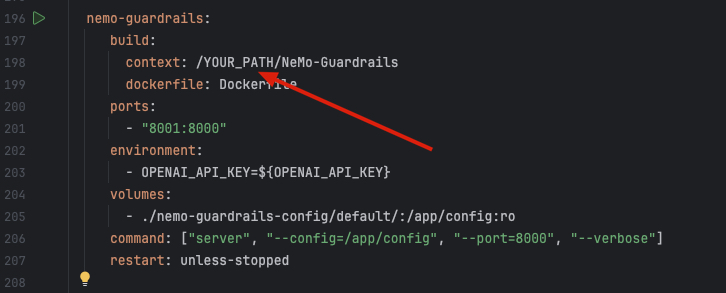

[](https://devfest2025.gdgnantes.com/en/sessions/la_guerre_des_prompts___attaques___defenses_au_royaume_des_llm________)

Ce tutorial est proposé en amont de la session [La Guerre des Prompts : attaques & défenses au royaume des LLM ⚔️🛡️🤖](https://devfest2025.gdgnantes.com/en/sessions/la_guerre_des_prompts___attaques___defenses_au_royaume_des_llm________) à Devfest Nantes 2025.


## Sommaire

- [Codelab](#codelab)
  - [Récupérer l'atelier](#récupérer-latelier)
  - [Python](#python)
  - [L'outil Docker](#loutil-docker)


- [OpenAi](#openai)
  - [Récupérer une clé OpenAi](#récupérer-une-clé-openai)


- [Ollama](#ollama)
  - [L'outil Ollama](#loutil-ollama)
  - [Les modèles Ollama](#les-modèles-ollama)


- [Les images Docker](#les-images-docker)
  - [Nemo Guardrails](#nemo-guardrails)
  - [Tock](#tock)


- [Installation des outils de tests de robustesse](#installation-des-outils-de-tests-de-robustesse)
  - [Installation de Garak](#installation-de-garak)
  - [Installation de PyRIT](#installation-de-pyrit)
  - [Installation de Promptfoo](#installation-de-promptfoo)


    
### Récupérer l'atelier
- Récupérez le projet depuis votre terminal en faisant une git clone du projet
  ```bash
  git clone git@github.com:pi-2r/devfest2025-La-Guerre-des-Prompts-attaques-et-defenses-au-royaume-des-LLM.git
  ```
- Ou bien téléchargez le projet en zip et dézippez-le sur votre machine : https://github.com/pi-2r/devfest2025-La-Guerre-des-Prompts-attaques-et-defenses-au-royaume-des-LLM/archive/refs/heads/main.zip

### Python

Installer Python 3.10 ou supérieur sur votre machine: https://www.python.org/downloads/


### L'outil Docker
- Avoir installé [Docker Desktop](https://www.docker.com/products/docker-desktop/) sur votre machine
  


### Récupérer une clé OpenAi
Allez sur https://platform.openai.com/signup pour créer un compte et récupérer une clé API. Dés que vous etes connecté, 
allez dans la section [API Keys](https://platform.openai.com/api-keys) pour créer une nouvelle clé. Vous devrez avoir cette page :


Puis cliquez sur le bouton **Create new secret key** pour générer une nouvelle clé au moment voulu dans le lab.


### L'outil Ollama
- Avoir installé [Ollama](https://ollama.com/download) sur votre machine


  


### Les modèles Ollama
- Avoir installé les principaux modèles pour l'atelier, commande à renseigner dans le terminal :
  ```bash
    ollama pull tinyllama
    ollama pull mistral
    ollama pull nomic-embed-text
  ```
Pour vérifier que nous avons les modèles sur notre machine, il suffit de taper cette commande dans notre terminal pour avoir ce type de rendu :

```bash
 ollama list
 ```


### Les images Docker

#### Nemo Guardrails

Depuis votre terminal, placez-vous dans le dossier où vous souhaitez installer le projet, par exemple **Documents**,
puis exécutez la commande suivante pour cloner le dépôt et entrer automatiquement dans le dossier créé :

```bash
git clone https://github.com/NVIDIA-NeMo/Guardrails.git && cd NeMo-Guardrails
pwd
```

#### Tock

Rendez-vous dans le dossier **lab/tock** .
Renseignez vos variables d'environnement dans le fichier **template-internet.env**, notement :

- la variable `OPENAI_API_KEY` avec la clé que vous avez récupérée précédemment.

Renommez le fichier **template-internet.env** en **.env**.


Dans le fichier **docker-compose-genai.yml**, en ligne 198 changer **YOUR_PATH** par le chemin absolu vers le 
dossier **NeMo-Guardrails**.




Toujours depuis ce dossier (**lab/tock**), lancez les commandes suivantes dans votre terminal :

```bash
source .env
docker compose -f docker-compose-genai.yml pull
```
Vous devriez obtenir un rendu similaire à celui-ci :


### Installation de Garak
Todo

### Installation de PyRIT

Depuis votre terminal, placez-vous dans le dossier où vous souhaitez installer le projet, par exemple **Documents**,
puis exécutez la commande suivante pour cloner le dépôt et entrer automatiquement dans le dossier créé :

```bash
git clone https://github.com/Azure/PyRIT.git && cd PyRIT
```

Ensuite, créez un environnement virtuel Python, activez-le, puis installez les dépendances du projet avec les commandes
suivantes :

```bash
# 1. Créer un environnement virtuel dans le répertoire courant
python3 -m venv .venv

# 2. Activer l’environnement virtuel
source .venv/bin/activate

# 3. Mettre à jour pip, setuptools et wheel dans l’environnement
pip install --upgrade pip setuptools wheel

# 4. Installer la dépendance requise
pip install IPython

# 5. Installer ce projet localement en mode développement (utile pour développement/débogage)
pip install -e .
```

Après exécution, vous devriez obtenir des messages indiquant la création de l’environnement virtuel, puis l’installation
des dépendances du projet. Par exemple :


### Installation de Promptfoo
Todo

