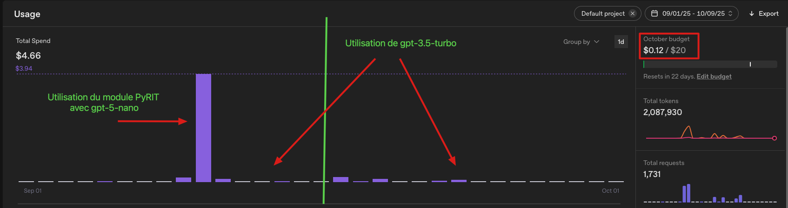

[](https://devfest2025.gdgnantes.com/en/sessions/la_guerre_des_prompts___attaques___defenses_au_royaume_des_llm________)

This tutorial is offered in advance of the session [The Prompt War: Attacks & Defenses in the Realm of LLMs ⚔️🛡️🤖](https://devfest2025.gdgnantes.com/en/sessions/la_guerre_des_prompts___attaques___defenses_au_royaume_des_llm________) at Devfest Nantes 2025.

## Table of Contents

- [Codelab](#codelab)
    - [Get the Workshop](#get-the-workshop)
    - [Python](#python)
    - [Docker Tool](#docker-tool)

- [OpenAI](#openai)
    - [Get an OpenAI API Key](#get-an-openai-api-key)

- [Ollama](#ollama)
    - [The Ollama Tool](#the-ollama-tool)
    - [Ollama Models](#ollama-models)

- [Docker Images](#docker-images)
    - [AI Red Teaming Playground Labs](#ai-red-teaming-playground-labs)
    - [Tock](#tock)

- [Installing Robustness Testing Tools](#installing-robustness-testing-tools)
    - [Install Garak](#install-garak)
    - [Install PyRIT](#install-pyrit)
    - [Install Promptfoo](#install-promptfoo)

### Get the Workshop

From your terminal, clone the repository:


  ```bash
  git clone git@github.com:pi-2r/devfest2025-La-Guerre-des-Prompts-attaques-et-defenses-au-royaume-des-LLM.git
  ```

Alternatively, download the .zip archive and unzip it locally:  
[https://github.com/pi-2r/devfest2025-La-Guerre-des-Prompts-attaques-et-defenses-au-royaume-des-LLM/archive/refs/heads/main.zip](https://github.com/pi-2r/devfest2025-La-Guerre-des-Prompts-attaques-et-defenses-au-royaume-des-LLM/archive/refs/heads/main.zip)

### Python

Install Python 3.10 or higher on your machine: [https://www.python.org/downloads/](https://www.python.org/downloads/)


### Docker Tool

Make sure you have [Docker Desktop](https://www.docker.com/products/docker-desktop/) installed.


### Get an OpenAI API Key

Go to [https://platform.openai.com/signup](https://platform.openai.com/signup) to create an account and get your API key.  
Once logged in, visit the [API Keys](https://platform.openai.com/api-keys) section to create a new key. You should see this page:


Click **Create new secret key** when ready during the lab.

> **Note**: OpenAI offers a $5 free credit for new users, sufficient for workshop exercises. After depletion, billing info is required. Monitor your usage to avoid unexpected fees: [https://termsoup.crisp.help/en-us/article/openai-free-trial-payment-token-limits-wds3wd/](https://termsoup.crisp.help/en-us/article/openai-free-trial-payment-token-limits-wds3wd/)

<details>
  <summary>🚧 💡 🚧 How much will it cost? Less than $5 🚧 💡 🚧</summary>

During the workshop with **regular use** of **gpt-3.5-turbo** and **moderate use** of **gpt-5-nano**, we spent under $5.


</details>

You can test your OpenAI API key with a simple curl request like this:

```bash
curl https://api.openai.com/v1/responses \
-H "Content-Type: application/json" \
-H "Authorization: Bearer $OPENAI_API_KEY" \
-d '{
"model": "gpt-3.5-turbo",
"input": "Tell me a three sentence bedtime story about a unicorn."
}'
```

### The Ollama Tool

Start by installing [Ollama](https://ollama.com/download) on your machine.


### Ollama Models

Prepare by installing main models with commands:


```bash
ollama pull tinyllama
ollama pull mistral
ollama pull nomic-embed-text
```

Check downloaded models:
```bash
 ollama list
 ```

You should see a list like this:


### Docker Images

#### AI Red Teaming Playground Labs

From your terminal, go to your desired folder (e.g., **Documents**) and clone the repo:


```bash
git clone https://github.com/microsoft/AI-Red-Teaming-Playground-Labs.git && cd AI-Red-Teaming-Playground-Labs
```

Rename the file **.env.example** to **.env**, then comment out all variables related to Microsoft OpenAI and uncomment 
those for classic OpenAI.

Next, fill in the required values such as the **OPENAI_API_KEY**, replacing the placeholder with your actual 
OpenAI API key, as shown in the example below:


Comment out any Azure or Microsoft-related fields, and ensure only the variables necessary for the standard OpenAI service remain active in the **.env** file.

From the **AI-Red-Teaming-Playground-Labs** folder, run the following commands in your terminal:


```bash
source .env
docker compose -f docker-compose-openai.yaml up
```

If everything is configured correctly, you should see a display similar to this:


To access the web interface, open your browser and go to:  
http://localhost:5000/login?auth=YOUR_AUTH_KEY (the value of **YOUR_AUTH_KEY** is indicated in the **.env** file).

#### Nemo Guardrails

In your terminal, navigate to the directory where you want to install the project (for example **Documents**).  
Then run the following command to clone the repository and go directly into the created folder:

```bash
git clone https://github.com/NVIDIA-NeMo/Guardrails.git && cd NeMo-Guardrails
pwd
```


#### Tock

Navigate to the **lab/tock** folder.

In the file **template-internet.env**, fill in the environment variable **OPENAI_API_KEY** with the API key you obtained earlier.

Once modified, rename this file **template-internet.env** to **.env**.

From the **lab/tock** folder, run the following commands in your terminal:

```bash
source .env
docker compose -f prerequisites-docker-compose-genai.yml pull
```

You should see a display similar to this:


Then start the environment with the command:


```bash
docker compose -f prerequisites-docker-compose-genai.yml up -d
```

You should see a display similar to this:


After a few moments, you should be able to access the Tock Studio interface at the following address: http://localhost/login


Finally, to stop the environment, use the command:


```bash
docker compose -f prerequisites-docker-compose-genai.yml down
```

### Installing Garak

From your terminal, navigate to the folder where you want to install the project, for example **Documents**,  
then run the following command to clone the repository and automatically enter the created folder:

```bash
# 1. Créer un environnement virtuel dans le répertoire courant
python3 -m venv .venv

# 2. Activer l’environnement virtuel
source .venv/bin/activate

# 3. Installer garak
python -m pip install -U garak
```

### Installing PyRIT

From your terminal, navigate to the folder where you want to install the project, for example **Documents**,  
then run the following command to clone the repository and automatically enter the created folder:


```bash
git clone https://github.com/Azure/PyRIT.git && cd PyRIT
```


Next, create a Python virtual environment, activate it, and install project dependencies with these commands:

```bash
# 1. Créer un environnement virtuel dans le répertoire courant
python3 -m venv .venv

# 2. Activer l’environnement virtuel
source .venv/bin/activate

# 3. Mettre à jour pip, setuptools et wheel dans l’environnement
pip install --upgrade pip setuptools wheel

# 4. Installer la dépendance requise
pip install IPython

# 5. Installer ce projet localement en mode développement (utile pour développement/débogage)
pip install -e .
```

After execution, you should see messages indicating the creation of the virtual environment, followed by the 
installation of the project dependencies. For example:


### Installing Promptfoo

We invite you to follow the official documentation for installing Promptfoo:  
https://www.promptfoo.dev/docs/red-team/quickstart/#initialize-the-project

