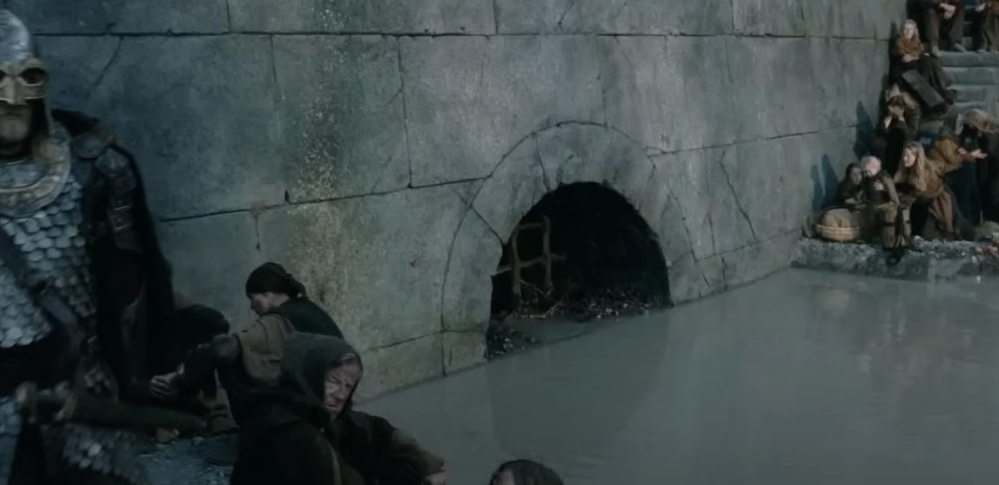

# Techniques d'Attaque par Prompt Injection

> "Helm's Deep has one weakness. It's outer wall is solid rock but for a small culvert at its base, which is little more than a drain.", Saruman, LOTR - The Two Towers

## 🎯 Objectifs de cette étape

- Avoir un panorama des principales techniques de prompt injection sur un LLM.
- Mettre en pratique ces techniques sur un LLM.

## Sommaire
- [Prompt Override](#Prompt-Override)
- [Style Injection](#Style-Injection)
- [Role-playing / Impersonation](#Role-playing)
- [Encoding / Obfuscation](#Encoding)
- [Automated Gradient-based Prompt Injection](#Automated-Gradient-based-Prompt-Injection)

## Prompt Override

TODO

## Role-playing / Impersonation

TODO

## Prompt Override

TODO

## Encoding / Obfuscation

TODO

## Automated Gradient-based Prompt Injection

TODO

