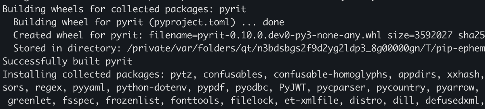

# PyRIT: Framework for Security Risk Identification and Red Teaming in Generative AI System

[](https://www.youtube.com/watch?v=__m75rCcusM)
> "They broke our defenses. They've taken the bridge and the West bank. Battalions of orcs are crossing the river", Gandalf, LOTR - The Return of the King


## 🎯 Objectifs de cette étape

- Todo


## Sommaire
- [Objectif principal](#objectif-principal)


- [PyRIT](#présentation-de-pyrit)
  - [Présentation de PyRIT](#présentation-de-pyrit)
  - [À quoi sert PyRIT ?](#à-quoi-sert-pyrit-)
  - [Comment ça fonctionne ?](#comment-ça-fonctionne-)
  - [Quels sont les 5 composants de PyRIT ?](#quels-sont-les-5-composants-de-pyrit-)
  - [schema d'architecture PyRIT](#schema-darchitecture-pyrit)

- [Let's play with PyRIT !](#Let's-play-with-PyRIT-)
  - [Installation de PyRIT](#installation-de-pyrit)
  - [Stratégies d'attaque](#stratégies-dattaque)
  - [Utilisation de PyRIT](#utilisation-de-pyrit)


- [Étape suivante](#étape-suivante)
- [Ressources](#ressources)

## Objectif principal

Dans cette partie, nous allons exploitez les fonctionnalités d’attaque automatisée de PyRIT pour tester la sécurité du
[playground Gandalf](https://gandalf.lakera.ai/) jusqu’au niveau 7.

L’objectif est de franchir progressivement les barrières de chaque niveau, en surmontant les défis croissants conçus 
pour résister aux manipulations et à l’extraction de données sensibles.


## PyRIT

PyRIT (Python Risk Identification Toolkit) est un framework open-source conçu pour faciliter l’identification des 
risques de sécurité dans les systèmes d’IA générative, via des approches de red teaming structurées et reproductibles.

### Présentation de PyRIT

**PyRIT** est un outil qui permet d’évaluer la robustesse et la sécurité des modèles d’IA générative (LLM, modèles 
multimodaux, etc.) en simulant, automatisant et analysant différents types d’attaques et comportements risqués. 

Il se veut agnostique par rapport aux modèles et plateformes : il peut donc être utilisé pour tester une large variété 
d’IA, quel que soit leur fournisseur ou leur type.

### A quoi sert PyRIT ?

- **Identifier les failles et vulnérabilités** dans les modèles d’IA générative (par exemple : jailbreaks, biais, contenus dangereux, attaques par injection de prompt, etc.).


- **Structurer et automatiser les tests de red teaming** (tests d’attaque par des "gentils hackers") pour évaluer les risques réels des modèles avant leur mise en production.


- **Établir des bases de comparaison et des métriques** pour mesurer les progrès ou comparer différents modèles ou itérations.


### Comment ça fonctionne ?

Le framework repose sur une architecture modulaire : chaque composant (attaque, cible, transformateur, système de 
scoring) peut être personnalisé et assemblé pour créer des flux d’évaluation adaptés à différents scénarios.

1.  On choisit d’abord un "orchestrateur" pour déterminer le type d’attaque/scénario souhaité (simple prompt, attaque 
sur plusieurs tours, attaque sur document externe, etc.).


2.  On configure la cible (le modèle d’IA ou l’API à tester).


3. On utilise des "converters" pour transformer ou modifier les prompts afin de tester la résistance du modèle aux 
différentes variations (traductions, substitutions, leetspeak, etc.).


4. On définit la stratégie d’attaque : prompts simples, templates à compléter, ou attaque générée dynamiquement par une
IA attaquante.


5. On évalue les réponses obtenues en utilisant des techniques de scoring : classification de contenu, échelle de 
Likert, ou personnalisation selon les besoins.

Dès lors, la modularité permet de composer ces briques pour couvrir des scénarios très variés et réalistes.


### Quels sont les 5 composants de PyRIT ?


| Module                | Description                                                                              | Exemples/Types                                                                                                                                                  |
|-----------------------|------------------------------------------------------------------------------------------|-----------------------------------------------------------------------------------------------------------------------------------------------------------------|
| **Orchestrators**     | Coordonnent le déroulement de l’attaque et la logique de dialogue                        | PromptSendingOrchestrator, RedTeamingOrchestrator, EndTokenRedTeamingOrchestrator, ScoringRedTeamingOrchestrator, XPIA Orchestrators                            |
| **Converters**        | Transforment les prompts pour tenter de contourner les gardes fous                       | leetspeak, ROT13, unicode confusable, variation/translation, etc.                                                                                               |
| **Targets**           | Interface vers le modèle à tester                                                        | API d’inférence, modèles chat, multimodal, stockage externe                                                                                                     |
| **Attack Strategies** | Définissent les objectifs d’attaque et la génération des prompts                         | Manuel, automatisé via IA attaquante                                                                                                                            |
| **Scoring**           | Analyse et évalue les réponses du modèle                                                 | Classificateurs de contenu (biais, thématique), échelles de Likert (graduation sur 5 niveaux), évaluations personnalisées (booléen, string, mot de passe, etc.) |


Pour les orchestrateurs, voici quelques details supplémentaires :
- **PromptSendingOrchestrator** : envoie un prompt simple au modèle et analyse la réponse.
- **RedTeamingOrchestrator** : simule une attaque de red teaming sur plusieurs tours de dialogue.
- **EndTokenRedTeamingOrchestrator** : similaire au précédent, mais s’arrête dès qu’un "end token" est détecté dans la réponse.
- **ScoringRedTeamingOrchestrator** : intègre une étape de scoring pour évaluer la qualité ou le risque de la réponse.
- **XPIA Orchestrators** : conçus pour tester les attaques par injection de prompt indirecte via données externes.


### schema d'architecture PyRIT

                        +---------------------+
                        |     Orchestrator    |
                        +---------+-----------+
                                  |
               +------------------|----------------------+
               |                  |                      |
       +-------v-----+    +-------v-------+     +--------v-------+
       |  Converter  |    |   Attack      |     |    Memory      |
       | (Prompt     |    |  Strategy     |     | (Logs, Recall) |
       | Transform   |    | (Objective,   |     |                |
       +-------------+    |  Templates)   |     +----------------+
               |          +---------------+               |
               |                  |                       |
       +-------v------------------+-----------------------v------+
       |                      Target (Model/API)                 |
       +-----------------------------+---------------------------+
                                     |
                            +--------v--------+
                            |   Scoring       |
                            | (Classifier,    |
                            | Likert Scale)   |
                            +-----------------+


## Let's play with PyRIT !

### Installation de PyRIT

Depuis votre terminal, placez-vous dans le dossier où vous souhaitez installer le projet, par exemple **Documents**,
puis exécutez la commande suivante pour cloner le dépôt et entrer automatiquement dans le dossier créé :

```bash
git clone https://github.com/Azure/PyRIT.git && cd PyRIT
```

Ensuite, créez un environnement virtuel Python, activez-le, puis installez les dépendances du projet avec les commandes
suivantes :

```bash
# 1. Créer un environnement virtuel dans le répertoire courant
python3 -m venv .venv

# 2. Activer l’environnement virtuel
source .venv/bin/activate

# 3. Mettre à jour pip, setuptools et wheel dans l’environnement
pip install --upgrade pip setuptools wheel

# 4. Installer la dépendance requise
pip install IPython

# 5. Installer ce projet localement en mode développement (utile pour développement/débogage)
pip install -e .
```

Après exécution, vous devriez obtenir des messages indiquant la création de l’environnement virtuel, puis l’installation
des dépendances du projet. Par exemple :




### Stratégies d'attaque

                +--------------------------+
                |   Définir l'Objectif     |
                +-----------+--------------+
                            |
                            v
                +--------------------------+
                |  Choisir AttackStrategy  |
                +-----------+--------------+
                            |
                            v
                +--------------------------+
                |  Générer ou choisir le   |
                |        prompt            |
                +-----------+--------------+
                            |
                            v
                +--------------------------+
                |    Appliquer Converter   |
                | (Transformation prompt)  |
                +-----------+--------------+
                            |
                            v
                +--------------------------+
                |   Envoyer au Target      |
                |   (modèle testé)         |
                +-----------+--------------+
                            |
                            v
                +--------------------------+
                |   Récupérer la réponse   |
                +-----------+--------------+
                            |
                            v
                +--------------------------+
                |     Scoring/Évaluation   |
                +-----------+--------------+
                            |
                            v
                +--------------------------+
                |      Enregistrer         |
                |    Score & logs          |
                +--------------------------+

## Utilisation de PyRIT
let's play with PyRIT !


## Étape suivante

- [Étape 11](step_11.md)

## Ressources


| Information                                                                       | Lien                                                                                                                                                                                                           |
|-----------------------------------------------------------------------------------|----------------------------------------------------------------------------------------------------------------------------------------------------------------------------------------------------------------|
| PyRIT: A Framework for [...] Red Teaming in Generative AI System                  | [https://arxiv.org/abs/2410.02828](https://arxiv.org/abs/2410.02828)                                                                                                                                           |
| PyRIT - Azure documentation                                                       | [https://azure.github.io/PyRIT/](https://azure.github.io/PyRIT/)                                                                                                                                               |
| PyRIT - Github                                                                    | [https://github.com/Azure/PyRIT](https://github.com/Azure/PyRIT)                                                                                                                                               |
| Youtube - PyRIT: A Framework for  [...] Red Teaming in Generative AI Systems      | [https://www.youtube.com/watch?v=KnV8Y97YKmU](https://www.youtube.com/watch?v=KnV8Y97YKmU)                                                                                                                     |
| Hacking generative AI with PyRIT  Black Hat Arsenal USA 2024                      | [https://www.youtube.com/watch?v=M_H8ulTMAe4](https://www.youtube.com/watch?v=M_H8ulTMAe4)                                                                                                                     |
| Red Teaming GenAI: The PyRIT Framework for Proactive Risk Identification          | [https://www.linkedin.com/pulse/red-teaming-genai-pyrit-framework-proactive-risk-p-raquel-bise--vh1ae/](https://www.linkedin.com/pulse/red-teaming-genai-pyrit-framework-proactive-risk-p-raquel-bise--vh1ae/) |
| PyRIT: Secure AI with Microsoft's Latest Tool (How-To)                            | [https://www.youtube.com/watch?v=HO4PW7aFmIU](https://www.youtube.com/watch?v=HO4PW7aFmIU)                                                                                                                     |
| BlueHat 2024: S24: Automate AI Red Teaming in your existing tool chain with PyRIT | [https://www.youtube.com/watch?v=wna5aIVfucI](https://www.youtube.com/watch?v=wna5aIVfucI)                                                                                                                     |
| Red Teaming AI: A Closer Look at PyRIT                                            | [https://medium.com/@dinber19/red-teaming-ai-a-closer-look-at-pyrit-e912c3a094ec](https://medium.com/@dinber19/red-teaming-ai-a-closer-look-at-pyrit-e912c3a094ec)                                             |
| Zero Day Quest - Learn to Red Team AI Systems Using PyRIT.                        | [https://www.youtube.com/watch?v=jq9DcEL3cHE](https://www.youtube.com/watch?v=jq9DcEL3cHE)                                                                                                                     |
| Microsoft AI Red Team ❤️ OpenAI GPT-5                                             | [https://www.linkedin.com/posts/ugcPost-7360830937988845570-388-/](https://www.linkedin.com/posts/ugcPost-7360830937988845570-388-/)                                                                           |
