# Mettre en place notre chatbot avec la solution Tock

[](https://www.youtube.com/watch?v=UCyqwsoISMs)
> "Prepare for battle !", Gandalf, LOTR - The Return of the King


## 🎯 Objectifs de cette étape

- Découvrir la solution Tock.
- Mettre en place un chatbot avec Tock.
- Créer une premiere intention
- Discuter avec le bot


## Sommaire
- [Présentation de Tock](#présentation-de-tock)

- [Installation de Tock](#installation-de-tock)
  - [Accéder à l'espace admin](#accéder-à-lespace-admin)
  - [Configurer Tock Studio](#configurer-tock-studio)
  - [Créer votre 1er Application](#créer-votre-1er-application)
  - [Communiquer avec le bot](#communiquer-avec-le-bot)


- [Création d'une FAQ](#création-dun-bot)
  - [Tester la FAQ](#tester-la-faq)
 
- [Schema d'architecture](#schema-darchitecture)

- [Étape suivante](#étape-suivante)
- [Ressources](#ressources)


## Présentation de Tock


[](https://pepy.tech/project/tock)


<details>
  <summary>Présentation de Tock lors du Devoxx 2025</summary>

Tock (https://doc.tock.ai/) est une plateforme conversationnelle ouverte.
La solution fut créée par SNCF Connect and Tech en 2016 pour motoriser le chatbot Voyages-sncf.com (puis OUI.sncf avant de devenir
SNCF Connect utilisé quotidiennement par des millions de français). Partagée en opensource sur GitHub dès 2017,
la solution a depuis été reprise par de nombreuses entreprises et une communauté d'utilisateurs et de contributeurs s'est créée.

Conçue comme une plateforme d'intégration de briques NLP (Natural Language Processing) sans dépendance forte et apportant
à la fois des interfaces graphiques utilisateur et un framework conversationnel en Kotlin, la plateforme a ensuite bien
évolué : connecteurs à de nombreux canaux textuels et vocaux, création de bots en mode "low code" dans Tock Studio,
compatibilité avec d'autres langages de programmation comme Javascript ou Python, ajout de fonctionnalités analytiques,
gestion multilingue, etc.

Plus récemment, avec l'essor de l'IA Générative et des LLM, Tock s'est révélée une plateforme efficace pour tester
et intégrer de nouvelles technologies conversationnelles, permettant des approches hybrides tout en restant en maîtrise
de la stack technique et des données. Certaines de ses fonctionnalités ont encore peu d'équivalents dans les solutions du marché :


- Combiner dans un même agent conversationnel IA Générative et arbres de décisions traditionnels
- Intégrer des solutions CSP utilisées par les équipes de Relation Client, pour passer facilement de l'IA Générative
- à un humain dans la même conversation
- Mécanismes pour activer/désactiver le RAG, exclure certains sujets, reconfigurer les prompts, etc.


**A noter** : c'est notamment grâce à des contributions ambitieuses des équipes Crédit Mutuel Arkéa (qui utilisent également
Tock depuis plusieurs années) que Tock a intégré ces dernières années des fonctionnalités autour des LLM et du RAG.
Cela montre toute la force de l'opensource et l'effet levier de la communauté pour une innovation qui profite à tous.
</a>
</details>


> ⚠️ Pour cette section, nous allons nous appuyer sur un chatbot orienté NLP qui servira de "chatbot intelligent".
>
> En effet, ce codelab est centré sur la sécurité et les risques liés au prompt-injection (et jailbreak), mais il ne
> couvre pas l’intégration des fonctionnalités LLM et RAG dans Tock.
> L’accent sera donc mis sur la compréhension et la mise en place des mécanismes de sécurité en amont.
> 
> À la fin de l’atelier et après avoir expérimenté les différentes mesures de défense pour sécuriser votre bot, 
> si le sujet vous intéresse de mettre en pratique un chatbot open source qui allie NLP et LLM, vous pourrez poursuivre
> avec un codelab complémentaire présenté lors du Devoxx 2025 : [A la recherche du RAG perdu 🤠🧭🤖 : créez votre IA Générative sans Internet](https://github.com/pi-2r/devoxxfr2025-tock-studio-IA-Gen)

## Installation de Tock


> **Je n'ai pas fait les pré-requis** : Pour gagner du temps pendant le lab vous pouvez utiliser l'instanc de tock partagé avec le compte que vous avez reçu sur un papier en entrant dans la salle.
> L'instant est accessible ici : http://192.168.20.2/
> Tous les comptes ont pour mots de passe password utilisez l'adresse mail en @mythos.world comme user.

Accédez au dossier **lab/tock**.


Une fois modifié, renommez ce fichier **template-internet.env** en **.env**.

Depuis le dossier **lab/tock**, exécutez les commandes suivantes dans votre terminal :

```bash
source .env
docker compose -f during-the-lab-docker-compose-genai.yml pull
```

Vous devriez voir un affichage similaire à celui-ci :

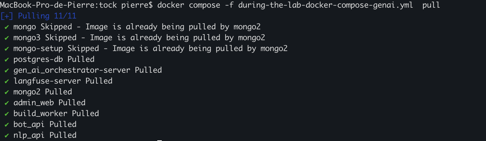

Démarrez ensuite l’environnement avec la commande :

```bash
docker compose -f during-the-lab-docker-compose-genai.yml up -d
```
Vous devriez voir un affichage similaire à celui-ci :


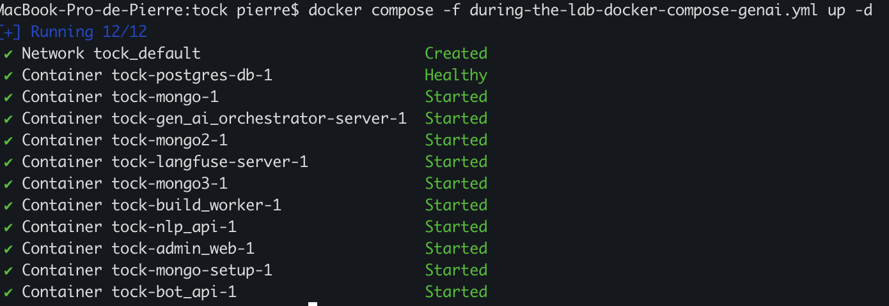


### Accéder à l'espace admin

Pour accéder à l'espace admin, ouvrez votre navigateur et tapez l'adresse suivante : http://localhost:80 et vous devriez arriver sur la page de login de Tock Studio.
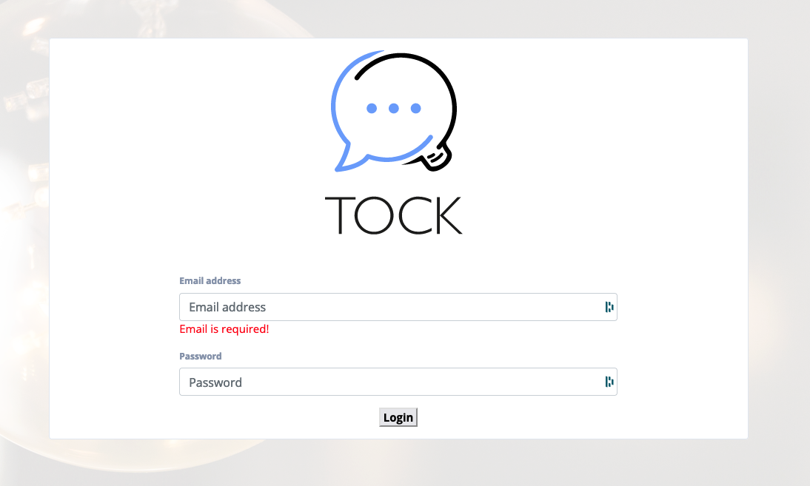

Pour se connecter, utilisez les identifiants suivants :
- username : admin@app.com
- password : password

> **Note 1** :
> Les identifiants sont par défaut dans le code source: https://github.com/theopenconversationkit/tock/blob/master/shared/src/main/kotlin/security/auth/PropertyBasedAuthProvider.kt

> **Note 2** :
> Toutes les variables d'environnement sont définies par le mot clé "**tock_**" (ex: tock_user, tock_password, ..).


### Configurer Tock Studio

Au premier accès à Tock Studio, un assistant simplifié permet de créer un premier assistant (automatiquement nommé
_new_assistant_).

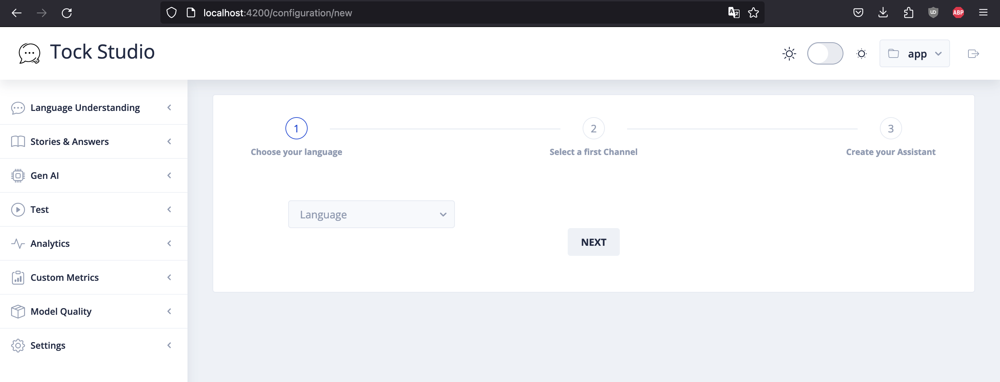

- A l'étape 1,**Choose your language** sélectionnez la langue **French** et cliquer sur le bouton **Next**.

- A l'étape 2, **Select a first Channel**, choisissez **Web** et cliquez sur le bouton **Next**.

- A l'étape 3, **Create your Assitant**, cliquez sur le bouton **Create**.


### Créer votre 1er Application

Nous allons créer un premier endpoint pour permettre d’interagir avec le bot.
Chaque endpoint correspond à une API avec un protocole spécifique, qui permet d’intégrer le bot à différents canaux 
externes (Slack, WhatsApp, Messenger, etc.), chacun ayant son propre langage de communication.

Il est possible d’ajouter ou de supprimer autant d’endpoints que souhaité sur un bot ; on les appelle également des 
_configurations_ ou _connecteurs_.
Le connecteur le plus simple pour interagir avec un bot Tock est le **connecteur Web**.


Pour vérifier que votre bot est bien configuré avec ce connecteur, rendez-vous dans la section **Settings** > **Configurations**
et assurez-vous que l’endpoint nommé **new_assistant🌎** est sélectionné.
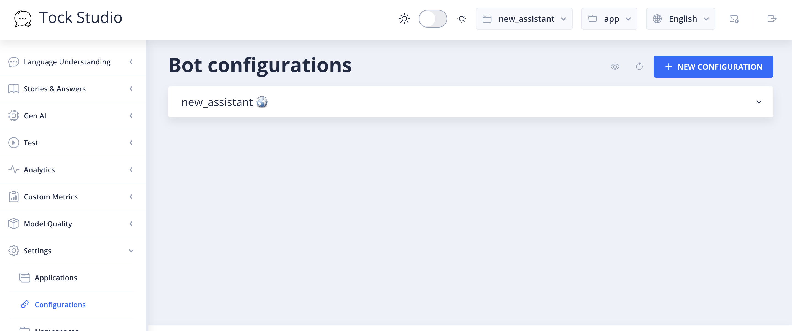

Si ce n’est pas le cas, cliquez sur **+ NEW CONFIGURATION**, choisissez le type **Web** puis validez avec Create.
Votre bot sera alors accessible via l’URL suivante : **io/app/new_assistant/web**.

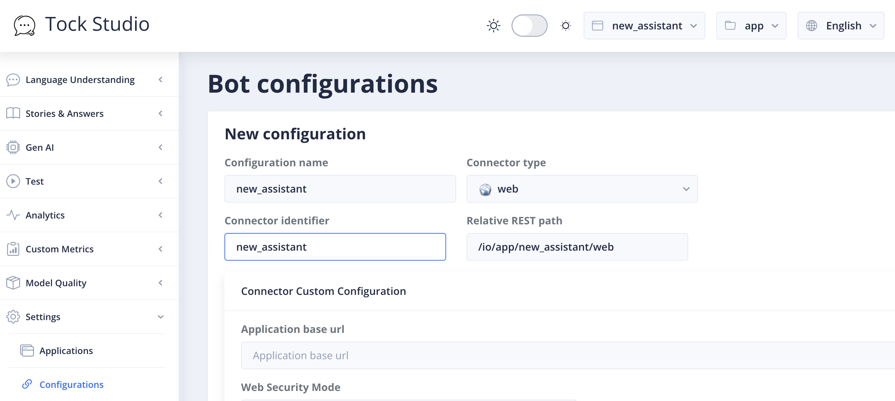

### Communiquer avec le bot
Dans le dossier lab/tock, ouvrez depuis votre navigateur web le fichier index.html, puis dite simplement bonjour au bot.

> **Instance partagée** : Si vous utilisez l'instance partagée de tock pensez à adapter l'URL dans index.html.
> Remplacez **const botDirectUrl = 'http://localhost:8080/io/app/new_assistant/web';**
> Par **const botDirectUrl = 'http://192.168.20.2:8080/io/$$VOTRE_USER_CE_QUI_EST_AVANT_LE_@$$/new_assistant/web';**
> Exemple pour le user medee@mythos.world par : **const botDirectUrl = 'http://192.168.20.2:8080/io/medee/new_assistant/web';**

Vous devriez avoir ce rendu.
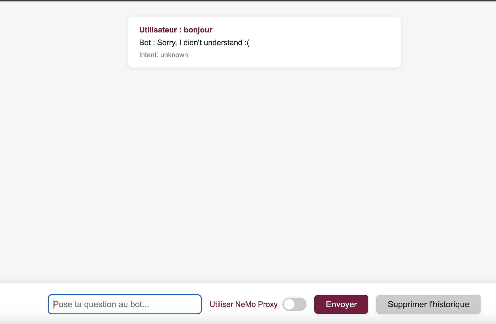

Frustrant mais fonctionnel !


### Création d'une FAQ

Allez dans la partie **Stories & Answers** > **FAQs stories** pour créer notre première interaction avec le bot.

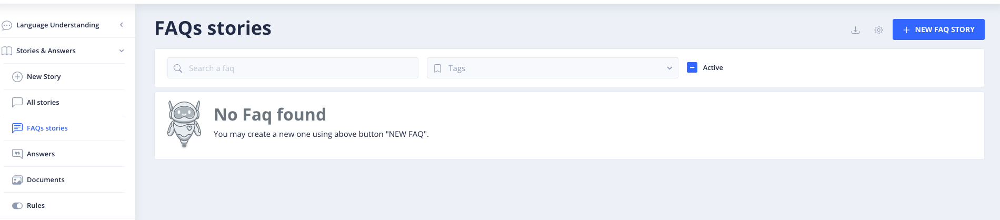


Cliquez sur le bouton bleu **+NEW FAQ STORY** pour voir apparaitre cet écran

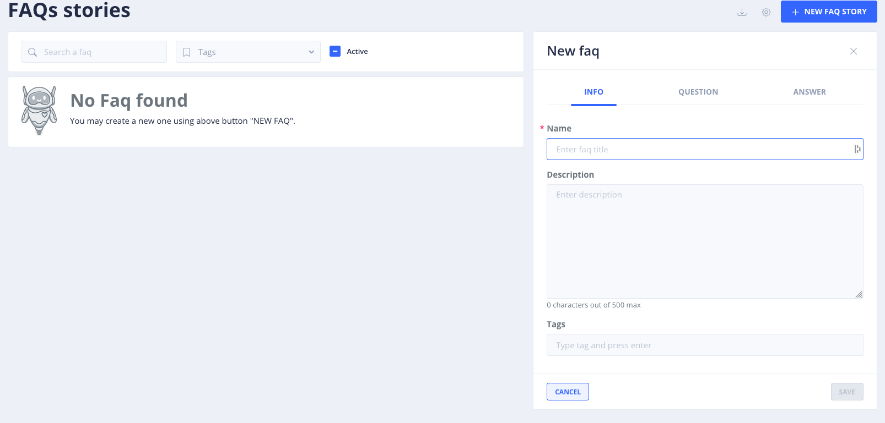

Donnez un nom à votre FAQ, pour nous se sera : **demo faq codelab**

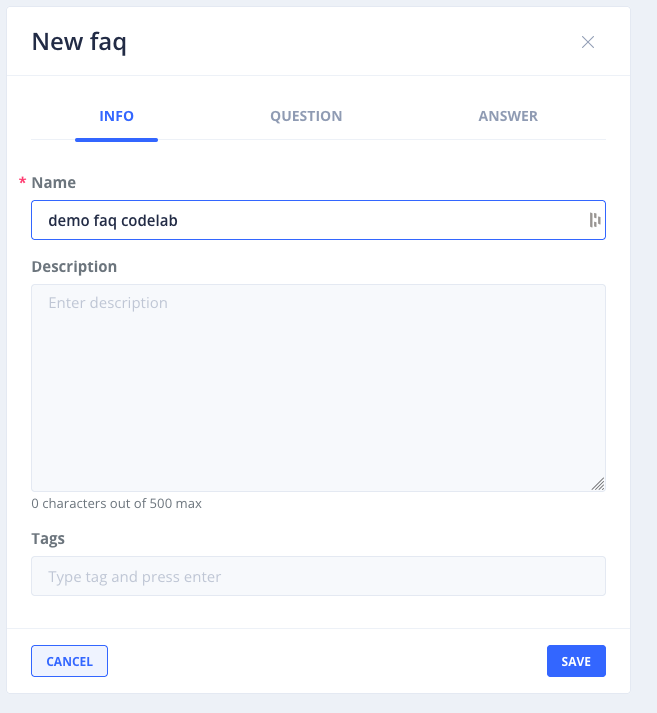

Cliquez ensuite sur l’onglet **QUESTION**

Dans le champ **Question**, écrivez **bonjour** puis cliquer sur **ADD**

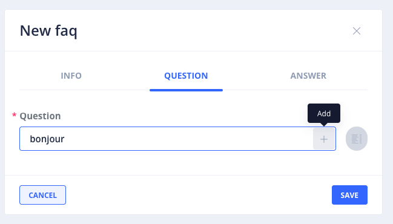

Vous devriez avoir ce rendu :

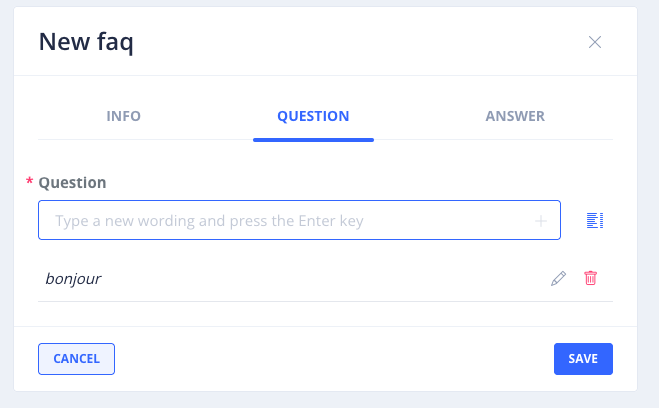

Ensuite, cliquez sur **ANSWER** pour ajouter une réponse à la question **bonjour**.
Copiez-collez le texte suivant dans le champ **Answer** :

```
Bonjour le Devfest 2025 !,
Vous êtes au codelab: La Guerre des Prompts : attaques & défenses au royaume des LLM ⚔️🛡️🤖
```

Vous devriez avoir ce rendu :

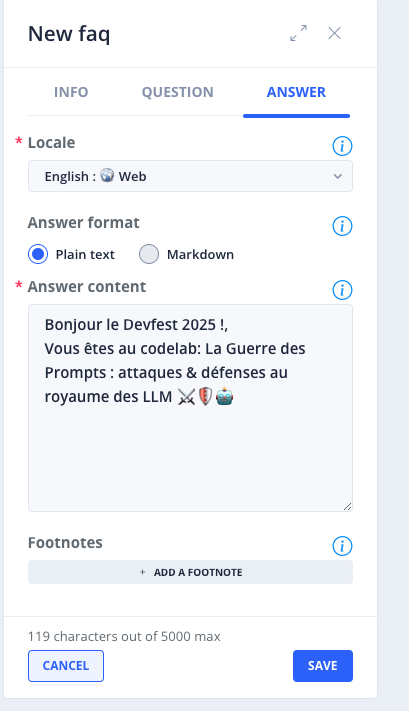

Puis cliquez sur le bouton **SAVE** pour enregistrer votre FAQ et ainsi avoir ce rendu :

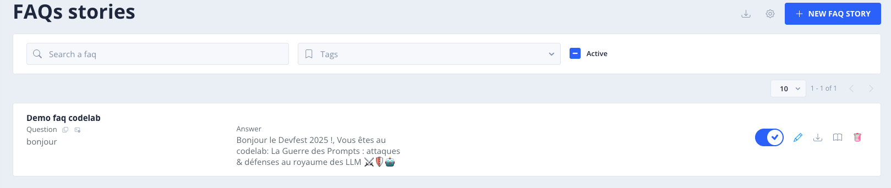


### Tester la FAQ

Depuis la page de test [index.html](index.html), si vous retester à nouveau en écrivant **Bonjour**, vous verrez que le
bot vous répondra ce qu’il a appris.
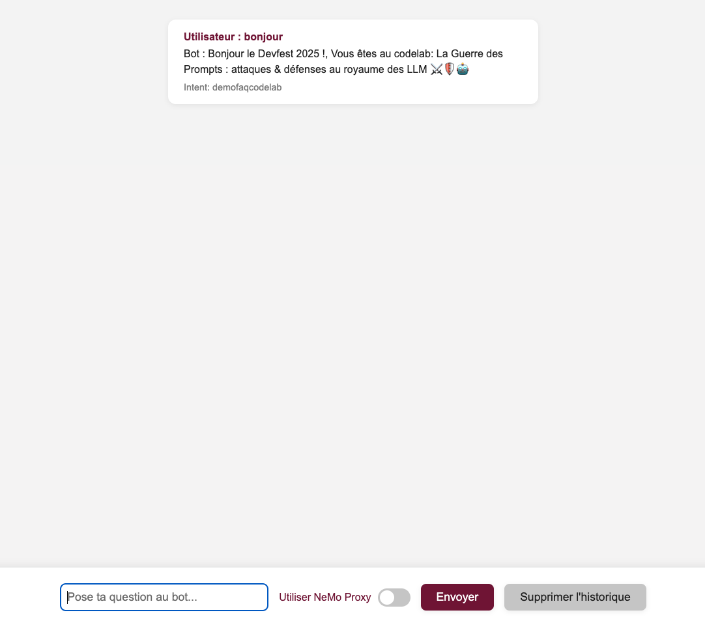


## Schema d'architecture

    +-------------+        +-------+      +------------------------------+
    |             | --->   |       | ---> |                              |
    | Utilisateur |        | Bot   |      | Base de données (Tock Studio)|
    |             | <---   |       | <--- |                              |
    +-------------+        +-------+      +------------------------------+


## Étape suivante

- [Étape 12](step_12.md)

## Ressources


| Information                                                                                 | Lien                                                                                                                 |
|---------------------------------------------------------------------------------------------|----------------------------------------------------------------------------------------------------------------------|
| [Devoxx 2025] A la recherche du RAG perdu 🤠🧭🤖 : créez votre IA Générative sans Internet  | [https://github.com/pi-2r/devoxxfr2025-tock-studio-IA-Gen](https://github.com/pi-2r/devoxxfr2025-tock-studio-IA-Gen) |
| Tock Documentation                                                                          | [https://doc.tock.ai/](https://doc.tock.ai/)                                                                         |
| [Nuit des Meetups] Mettons un peu d’IA Générative dans un bot classique 🤖🚀                | [https://github.com/pi-2r/Nuit-des-Meetups-2024](https://github.com/pi-2r/Nuit-des-Meetups-2024)                     |
