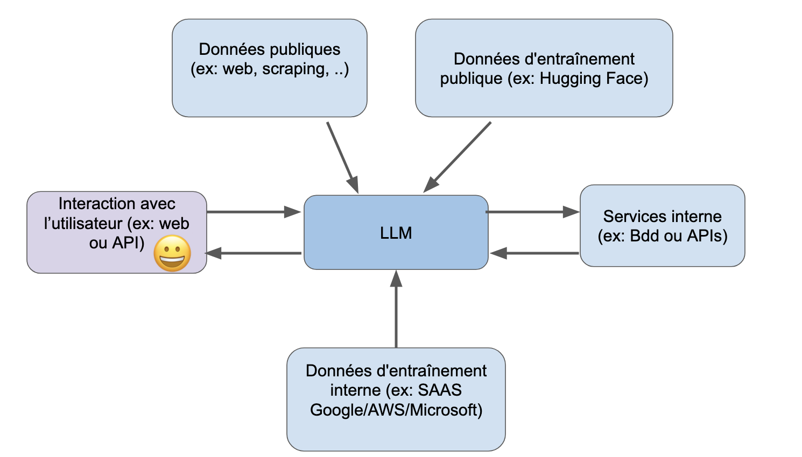
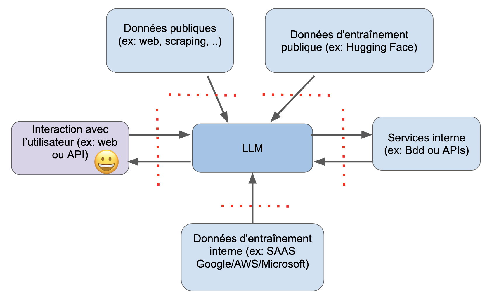

#  Pourquoi la Sécurité des LLM est-elle Cruciale ?

> "The year 3434 of the Second Age. Here follows the account of Isildur, High King of Gondor, and the finding of the ring 
> of power. It has come to me. The One Ring", Gandalf, LOTR - The Followship of the Ring

## 🎯 Objectifs de cette étape

- Avoir une vue d'ensemble sur la nouvelle ère technologique de l'IA générative.
- Comprendre l'importance de la sécurité des LLM dans le contexte de l'IA générative.

## Sommaire

- [L'émergence de l'IA, une nouvelle ère technologique](#l-emergence-de-l-ia-une-nouvelle-ere-technologique)

- [Le LLM, un cerveau connecté à vos programmes](#le-llm-un-cerveau-connecte-a-vos-programmes)
- [Les différents points de contrôle](#les-différents-points-de-contrôle)
  - [Interaction avec l'utilisateur](#interaction-avec-lutilisateur)
  - [Données d'entraînement publique](#données-dentrainement-publique)
  - [Données d'entraînement interne](#données-dentrainement-interne)
  - [Services internes](#services-internes)
  - [Accès aux données publiques](#accès-aux-données-publiques)

- [Le modèle LLM](#le-modèle-llm)
  - [Modèle par API](#modèle-par-api)
  - [Modèle hébergé](#modèle-hébergé)

- [Étape suivante](#étape-suivante)
- [Ressources](#ressources)

## L'émergence de l'IA, une nouvelle ère technologique

L’essor fulgurant de l’intelligence artificielle, porté notamment par ChatGPT, a propulsé cette technologie sur le 
devant de la scène. Son adoption massive ne se limite plus au grand public: les entreprises, séduites par l’efficacité 
des grands modèles de langage (LLM) dans les applications d’IA générative, en font désormais un levier incontournable 
de productivité.

Cependant, cette popularité s’accompagne de nouveaux enjeux majeurs en matière de sécurité. Les LLM introduisent des 
risques spécifiques, différents des menaces cyber classiques telles que les attaques DDoS, les injections SQL/XSS ou 
les ransomwares. Leur capacité à interpréter et générer du langage naturel via des prompts ouvre la voie à des 
vulnérabilités inédite : manipulation des requêtes, génération de contenus malveillants ou inappropriés, exfiltration 
d’informations sensibles, ou encore actions non prévues par les concepteurs du système. Voyons cela plus en détails.

<!--  -->

# Le LLM, un cerveau connecté à vos programmes

Les développeurs, tout comme les entreprises qui les emploient, perçoivent fréquemment les grands modèles de langage (LLM)
comme des systèmes autonomes, capables d’exploits remarquables en matière de compréhension et de génération de contenus. 
Pourtant, dans la réalité de l’ingénierie logicielle, les LLM ne fonctionnent que rarement de manière isolé: 
ils s’intègrent généralement au cœur d’architectures décisionnelles complexes, conçues pour accroître l’autonomie des applications.

Ces architectures reposent sur l’interconnexion de multiples composants, chacun jouant un rôle spécifique dans la chaîne
de traitement. Cette organisation modulaire est essentielle pour garantir la cohérence, la robustesse et la performance 
globale des solutions basées sur l’IA générative. Ainsi, le LLM agit comme un maillon central, mais il dépend étroitement
de l’ensemble du système pour délivrer des résultats fiables et pertinents. Il est donc essentiel d’avoir une vision 
d’ensemble de l’architecture qui entoure le LLM déployé.

Le schéma ci-dessous présente une version simplifiée de l’intégration d’un LLM dans un environnement d’entreprise.

 

En soi, la démarche reste relativement simple. Cependant, il est indispensable de mettre en place des points de contrôle
sur les connexions auxquelles le LLM a accès. Ces contrôles peuvent prendre différentes formes, telles que l’authentification, 
la validation des données ou encore la gestion des autorisations d’accès.

Le schéma ci-dessous propose une vue simplifiée des principaux points de contrôle à considérer.

 

## Les différents points de contrôle

### Interaction avec l'utilisateur
Il est important de considérer que les utilisateurs peuvent, intentionnellement ou non, introduire des erreurs. Il est 
donc essentiel de mettre en place des dispositifs visant à protéger le modèle LLM contre des entrées potentiellement 
contradictoires ou trompeuses, qu’elles proviennent des utilisateurs ou d’autres systèmes. Une vigilance particulière 
doit également être accordée aux contenus toxiques, inexacts ou sensibles que le modèle pourrait générer et transmettre 
à l’utilisateur.

### Données d'entraînement publique
Les LLM sont généralement entraînés à partir d’immenses ensembles de données issues d’Internet. Il est donc essentiel de 
considérer ces sources comme potentiellement peu fiables et de rester vigilant face aux risques de toxicité, de biais 
ou d’empoisonnement des données provenant d’informations contradictoires. Exemple Grok avec son modèle issue de la 
plateforme X (anciennement Twitter) qui se base essentiellement sur les commentaires (Troll ?) des utilisateurs.

### Données d'entraînement interne

Il est possible d’utiliser des données internes pour optimiser le modèle, ce qui peut sensiblement accroître sa précision. 
Toutefois, il est impératif de s’assurer que les informations sensibles, confidentielles ou à caractère personnel ne 
soient ni intégrées ni exposées lors de ce processus.

### Services internes
Il est indispensable de maîtriser la manière dont le LLM interagit avec les services connectés de l’entreprise, tels 
que les bases de données ou les API, afin de prévenir toute interaction non autorisée ou fuite de données, comme des 
injections SQL ou des requêtes abusives sur les API.

### Accès aux données publiques
L’extraction de données en temps réel depuis le Web, notamment par le biais de techniques de scraping, peut constituer 
un levier efficace pour enrichir les fonctionnalités de votre application. Toutefois, il est essentiel de considérer 
ces informations comme potentiellement peu fiables et de rester attentif à des risques tels que l’injection indirecte 
d’invites. Cette vigilance doit être renforcée si vous permettez aux utilisateurs de proposer des sites web à explorer 
ou de téléverser des documents susceptibles d’être compromis.

# Le modèle LLM

Le modèle de langage constitue le cœur de toute application basée sur un LLM. Il joue un rôle central en collectant et 
en interprétant les informations afin de permettre l’exécution d’actions au sein d’un environnement informatique.

Selon la configuration de votre infrastructure et vos besoins spécifiques, deux options s’offrent à vous pour permettre 
à votre écosystème d’interagir avec le modèle :
- **Modèle par API** : Par le biais d’une API publique, hébergée par un prestataire externe (ex. OpenAI, Google, Amazon 
    Bedrock, etc.), qui permet d’accéder à un modèle pré-entraîné et de l’utiliser pour générer des réponses ou des actions.

- **Modèle hébergé** : En déployant un modèle hébergé localement, au sein de vos propres installations (on-premises) ou 
    dans le cloud, ce qui vous permet de contrôler entièrement le modèle et de l’adapter à vos besoins spécifiques.

## Modèle par API
todo

## Modèle hébergé
todo

## Étape suivante

- [Étape 3](step_3.md)

## Ressources

| Information                                                                                         | Lien                                                                                                                                                                                                                                                                               |
|-----------------------------------------------------------------------------------------------------|------------------------------------------------------------------------------------------------------------------------------------------------------------------------------------------------------------------------------------------------------------------------------------|
| How AI can move from hype to global solutions                                                       | [https://www.weforum.org/stories/2025/01/ai-transformation-industries-responsible-innovation/](https://www.weforum.org/stories/2025/01/ai-transformation-industries-responsible-innovation/)                                                                                       |
| ChatGPT séduit les pros : 32 % des entreprises US utilisent OpenAI, loin devant Google et Anthropic | [https://siecledigital.fr/2025/05/12/chatgpt-seduit-les-pros-32-des-entreprises-us-utilisent-openai-loin-devant-google-et-anthropic/](https://siecledigital.fr/2025/05/12/chatgpt-seduit-les-pros-32-des-entreprises-us-utilisent-openai-loin-devant-google-et-anthropic/)         |
| Large language models : les nouveaux enjeux à venir dans la cybersécurité                           | [https://www.journaldunet.com/intelligence-artificielle/1542135-large-language-models-les-nouveaux-enjeux-a-venir-dans-la-cybersecurite/](https://www.journaldunet.com/intelligence-artificielle/1542135-large-language-models-les-nouveaux-enjeux-a-venir-dans-la-cybersecurite/) |
| Vulnérabilités LLM et sécurité des IA génératives                                                   | [https://www.vaadata.com/blog/fr/vulnerabilites-llm-et-securite-des-ia-generatives/](https://www.vaadata.com/blog/fr/vulnerabilites-llm-et-securite-des-ia-generatives/)                                                                                                           |
| L'IA en cybersécurité : comprendre les risques                                                      | [https://www.malwarebytes.com/fr/cybersecurity/basics/risks-of-ai-in-cyber-security](https://www.malwarebytes.com/fr/cybersecurity/basics/risks-of-ai-in-cyber-security)                                                                                                           | 
 

