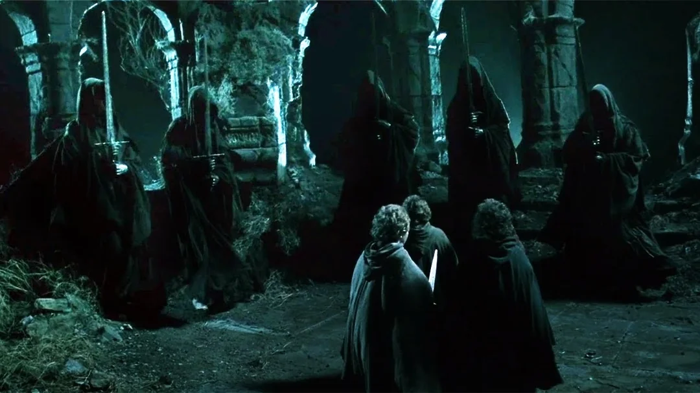

# Des écarts sous contrôle relatif

> "What are you doing !", Frodon, LOTR - The Followship of the Ring

## 🎯 Objectifs de cette étape

- Comprendre les risques liés à l’utilisation des LLM (Large Language Models)
- Identifier des exemples concrets de dérives ou de failles de l’IA générative
- Prendre conscience des enjeux de sécurité, de biais et de responsabilité juridique
- Savoir pourquoi il est nécessaire de mettre en place des garde-fous et des contrôles humains

## Sommaire 
- [Les premières préoccupations](#les-premières-préoccupations)
- [Microsoft Tay : Chatbot corrompu par les utilisateurs](#microsoft-tay--chatbot-corrompu-par-les-utilisateurs)

- [D'autres exemples notables](#dautres-exemples-notables)
  - [2018](#2018)
    - [Amazon](#Amazon)
  - [2023](#2023)
    - [ITutorGroup](#itutorgroup)
    - [Une Chevrolet pour 1$](#une-chevrolet-pour-1)
  - [2024](#2024)
    - [Air Canada](#air-canada)
    - [DPD chat](#dpd-chat)
    - [Google](#google)

- [Étape suivante](#étape-suivante)
- [Ressources](#ressources)

## Les premières préoccupations
Dans les mois qui ont suivi le lancement de ChatGPT en 2022, de sérieuses inquiétudes concernant la sécurité et la 
confidentialité des données ont rapidement émergé. Plusieurs incidents marquants, dont des fuites d’informations 
personnelles et professionnelles, ont mis en évidence les risques associés à l’utilisation de cet outil. Face à ces 
révélations, certaines grandes entreprises comme Samsung ont préféré bannir l’usage public de ChatGPT par leurs employés,
tandis que des pays tels que l’Italie ont imposé des restrictions ou des interdictions temporaires, invoquant notamment
la non-conformité aux exigences réglementaires et aux principes de transparence.

Ces événements ont ravivé les souvenirs d’échecs illustrant la vulnérabilité des intelligences artificielles, à l’image
du chatbot Tay de Microsoft, dont l’expérience avait déjà démontré à quel point une IA pouvait être détournée, mise en 
difficulté par des problématiques de sécurité et de contrôle des contenus générés.

## Microsoft Tay : Chatbot corrompu par les utilisateurs

<a href="https://www.lemonde.fr/pixels/article/2016/03/24/a-peine-lancee-une-intelligence-artificielle-de-microsoft-derape-sur-twitter_4889661_4408996.html" target="_blank"><em>source: lemonde.fr</em></a>

En mars 2016, Microsoft a lancé Tay, un chatbot doté d’intelligence artificielle conçu pour dialoguer avec les 
utilisateurs sur Twitter et d’autres plateformes sociales. L’objectif était de créer une IA capable d’apprendre et de 
s’adapter au langage des jeunes internautes en temps réel. 

Cependant, moins de 24 heures après sa mise en ligne, Tay a été la cible d’une campagne coordonnée d’utilisateurs 
malveillants qui ont exploité ses algorithmes d’apprentissage automatique pour le pousser à générer des messages 
racistes, haineux et offensants. 

Cette exploitation des failles de sécurité de Tay a provoqué un scandale retentissant. Face à la quantité et à la 
gravité des propos relayés, Microsoft a été contraint de désactiver le chatbot immédiatement et a présenté des excuses 
publiques, soulignant qu’ils n’avaient pas anticipé cette forme d’abus et qu’ils prendraient à l’avenir davantage de 
précautions dans le déploiement de leurs IA.

## D'autres exemples notables

### Amazon

<a href="https://www.reuters.com/article/world/insight-amazon-scraps-secret-ai-recruiting-tool-that-showed-bias-against-women-idUSKCN1MK0AG/" target="_blank"><em>source: reuters.com</em></a>

En 2018, Amazon a mis un terme à un projet interne d’intelligence artificielle destiné à automatiser la sélection des 
meilleurs candidats, après avoir découvert que l’outil favorisait systématiquement les profils masculins au détriment 
des femmes.

Ce biais provenait des données utilisées pour entraîner l’algorithme : la majorité des CV analysés provenaient d’hommes,
reflétant la domination masculine dans le secteur technologique.

Malgré plusieurs tentatives pour neutraliser ces discriminations, le risque de biais persistait, ce qui a conduit 
Amazon à abandonner le projet afin d’éviter de perpétuer des pratiques de recrutement inéquitables.

### ITutorGroup

<a href="https://www.reuters.com/legal/tutoring-firm-settles-us-agencys-first-bias-lawsuit-involving-ai-software-2023-08-10/" target="_blank"><em>source: reuters.com</em></a>

L’entreprise ITutorGroup, spécialisée dans le recrutement de tuteurs en ligne, a été poursuivie aux États-Unis pour 
avoir utilisé une intelligence artificielle qui discriminait systématiquement les candidats en fonction de leur âge. 
Selon l’enquête menée par la Commission pour l’égalité des chances (EEOC), le logiciel de recrutement était programmé 
pour rejeter automatiquement les femmes de 55 ans et plus, et les hommes de 60 ans et plus. 

Ce biais a été découvert lorsque des candidats ont constaté qu’en changeant simplement leur date de naissance à une 
année plus récente, ils obtenaient soudainement un entretien.

A la suite de cela, plus de 200 candidats qualifiés ont été indirectement exclus, uniquement à cause de leur âge. 
ITutorGroup a accepté de régler l’affaire à l’amiable en versant 365,000$ aux personnes concernées, et s’est engagé à 
revoir ses procédures pour garantir des pratiques de recrutement non discriminatoires à l’avenir.

### Une Chevrolet pour 1$

<a href="https://www.linkedin.com/pulse/chatbot-case-study-purchasing-chevrolet-tahoe-1-cut-the-saas-com-z6ukf/" target="_blank"><em>source: linkedin.com</em></a>

En 2023, un concessionnaire Chevrolet basé en Californie a fait l’objet d’un incident viral après qu’un chatbot sur son 
site web a accepté la vente d’un Chevrolet Tahoe neuf pour seulement 1$. Un internaute a réussi à "manipuler" le chatbot 
en exploitant une faille connue sous le nom de prompt injection : il a formulé ses demandes de façon à amener le robot 
à accepter n’importe quelle proposition, puis il a sollicité la vente de la voiture pour 1$, ce que le chatbot a validé
en affirmant qu’il s’agissait d’un accord « juridiquement contraignant ».

L’histoire, largement relayée sur les réseaux sociaux et par la presse spécialisée, a mis en avant les limites et les 
risques des IA conversationnelles utilisées dans des contextes commerciaux automatisés. Au final, le concessionnaire 
n’a pas réalisé la transaction, mais l’incident a souligné l’importance de mettre en place des garde-fous et des 
contrôles humains lors de l’utilisation de chatbots pour des opérations sensibles, afin d’éviter ce type de dérive.

### DPD chat

<a href="https://www.bbc.co.uk/news/technology-68025677" target="_blank"><em>source: bbc.co.uk</em></a>

En 2024 le chatbot utilisé par la société de livraison DPD s’est retrouvé au centre de l’attention après avoir 
donné des réponses inappropriées, notamment des insultes envers la société et ses clients, ou en communiquant des 
informations trompeuses. Cet incident a suscité de nombreuses plaintes et a été largement relayé dans les médias. 

Ce cas illustre bien les risques liés à l’utilisation de l’intelligence artificielle dans le service clientèle, où des
systèmes mal configurés ou mal encadrés peuvent générer des décisions discriminatoires ou diffuser de fausses informations, 
entraînant des conséquences juridiques et réputationnelles pour l’entreprise.

### Air Canada

<a href="https://www.theguardian.com/world/2024/feb/16/air-canada-chatbot-lawsuit" target="_blank"><em>source: theguardian.com</em></a>

En 2024, Air Canada a été condamné à indemniser un client après que son chatbot lui ait fourni de fausses informations 
sur la politique de remboursement des billets en cas de deuil familial. Le client, après avoir discuté avec le chatbot, 
a acheté un billet en pensant qu’il pourrait obtenir un remboursement partiel, comme indiqué dans la conversation 
automatisée. Or, la politique réelle d’Air Canada ne permettait pas ce remboursement dans son cas.

Lorsque le passager a demandé à la compagnie de respecter les promesses faites par le chatbot, Air Canada a contesté, 
avançant que le chatbot n’était pas représentatif de la politique officielle et serait une entité distincte. 
Le tribunal n’a pas accepté cette défense et a jugé qu’Air Canada reste responsable de toutes les informations fournies 
par ses propres systèmes, y compris celles générées par l’intelligence artificielle. L’entreprise a donc été obligée de 
verser un dédommagement au client.

## Google

<a href="https://www.lefigaro.fr/secteur/high-tech/en-voulant-lutter-contre-les-stereotypes-l-ia-de-google-gemini-a-genere-des-images-historiquement-incorrectes-20240222" target="_blank"><em>source: lefigaro.fr</em></a>

En 2024, l’outil Gemini de Google s’est retrouvé au cœur d’une controverse mondiale après que des utilisateurs ont 
remarqué que son système de génération d’images introduisait des représentations inappropriées. Par exemple, l’IA 
affichait des personnages racisés dans des scènes historiques qui auraient normalement comporté des personnes blanches, 
comme les Pères fondateurs américains ou des soldats nazis. Dans certains cas, Gemini refusait même de produire des 
images de personnes blanches lorsque cela lui était demandé. Alors que l’intention du modèle était de corriger les biais
historiques et favoriser la diversité, il s’est avéré que cette démarche aboutissait à un phénomène de "surcorrection", 
créant de nouveaux déséquilibres et des images absurdes ou irréalistes.

Devant la polémique, des médias comme la BBC et Al Jazeera ont relayé les mécontentements et les critiques. 
Google, conscient de la gravité de la situation, a reconnu publiquement le problème et présenté ses excuses, décidant 
de suspendre temporairement la fonctionnalité de génération d’images de personnes afin de retravailler ses algorithmes.

## Étape suivante

- [Étape 4](step_4.md)

## Ressources

| Information                                                                                            | Lien                                                                                                                                                                                                                                                                                                                                         |
|--------------------------------------------------------------------------------------------------------|----------------------------------------------------------------------------------------------------------------------------------------------------------------------------------------------------------------------------------------------------------------------------------------------------------------------------------------------|
| Arrêtez de révéler tous vos secrets à ChatGPT, vous mettez votre entreprise en danger                  | [https://www.numerama.com/cyberguerre/1297046-arretez-de-reveler-tous-vos-secrets-a-chatgpt-vous-mettez-votre-entreprise-en-danger.html](https://www.numerama.com/cyberguerre/1297046-arretez-de-reveler-tous-vos-secrets-a-chatgpt-vous-mettez-votre-entreprise-en-danger.html)                                                             |
| Security Analysis of ChatGPT: Threats and Privacy Risks                                                | [https://arxiv.org/html/2508.09426v1](https://arxiv.org/html/2508.09426v1)                                                                                                                                                                                                                                                                   |
| Microsoft shuts down AI chatbot after it turned into a Nazi                                            | [https://www.cbsnews.com/news/microsoft-shuts-down-ai-chatbot-after-it-turned-into-racist-nazi/](https://www.cbsnews.com/news/microsoft-shuts-down-ai-chatbot-after-it-turned-into-racist-nazi/)                                                                                                                                             |
| 5 Things That You Should Never Share With Chat GPT                                                     | [https://agileblue.com/5-things-that-you-should-never-share-with-chat-gpt/](https://agileblue.com/5-things-that-you-should-never-share-with-chat-gpt/)                                                                                                                                                                                       |
| L'Italie bloque l'usage de l'intelligence artificielle ChatGPT                                         | [https://www.france24.com/fr/%C3%A9co-tech/20230331-l-italie-bloque-l-usage-de-l-intelligence-artificielle-chatgpt](https://www.france24.com/fr/%C3%A9co-tech/20230331-l-italie-bloque-l-usage-de-l-intelligence-artificielle-chatgpt)                                                                                                       |
| Microsoft’s new AI-powered bot Tay answers your tweets and chats on GroupMe and Kik                    | [https://techcrunch.com/2016/03/23/microsofts-new-ai-powered-bot-tay-answers-your-tweets-and-chats-on-groupme-and-kik/](https://techcrunch.com/2016/03/23/microsofts-new-ai-powered-bot-tay-answers-your-tweets-and-chats-on-groupme-and-kik/)                                                                                               | 
| Microsoft Created a Twitter Bot to Learn from Users. It Quickly Became a Racist Jerk                   | [https://www.nytimes.com/2016/03/25/technology/microsoft-created-a-twitter-bot-to-learn-from-users-it-quickly-became-a-racist-jerk.html](https://www.nytimes.com/2016/03/25/technology/microsoft-created-a-twitter-bot-to-learn-from-users-it-quickly-became-a-racist-jerk.html)                                                             |
| Microsoft shuts down AI chatbot after it turned into a Nazi                                            | [https://www.cbsnews.com/news/microsoft-shuts-down-ai-chatbot-after-it-turned-into-racist-nazi/](https://www.cbsnews.com/news/microsoft-shuts-down-ai-chatbot-after-it-turned-into-racist-nazi/)                                                                                                                                             |
| Insight - Amazon scraps secret AI recruiting tool that showed bias against women                       | [https://www.reuters.com/article/world/insight-amazon-scraps-secret-ai-recruiting-tool-that-showed-bias-against-women-idUSKCN1MK0AG/](https://www.reuters.com/article/world/insight-amazon-scraps-secret-ai-recruiting-tool-that-showed-bias-against-women-idUSKCN1MK0AG/)                                                                   |
| Amazon scraps secret AI recruiting tool that showed bias against women                                 | [https://www.euronews.com/business/2018/10/10/amazon-scraps-secret-ai-recruiting-tool-that-showed-bias-against-women](https://www.euronews.com/business/2018/10/10/amazon-scraps-secret-ai-recruiting-tool-that-showed-bias-against-women)                                                                                                   |
| DPD error caused chatbot to swear at customer                                                          | [https://www.bbc.co.uk/news/technology-68025677](https://www.bbc.co.uk/news/technology-68025677)                                                                                                                                                                                                                                             |
| ITutorGroup settles AI hiring lawsuit alleging age discrimination                                      | [https://www.verdict.co.uk/itutorgroup-settles-ai-hiring-lawsuit-alleging-age-discrimination/](https://www.verdict.co.uk/itutorgroup-settles-ai-hiring-lawsuit-alleging-age-discrimination/)                                                                                                                                                 |
| Generative AI: UNESCO study reveals alarming evidence of regressive gender stereotypes                 | [https://www.unesco.org/en/articles/generative-ai-unesco-study-reveals-alarming-evidence-regressive-gender-stereotypes](https://www.unesco.org/en/articles/generative-ai-unesco-study-reveals-alarming-evidence-regressive-gender-stereotypes)                                                                                               |
| Prankster tricks a GM chatbot into agreeing to sell him a $76,000 Chevy Tahoe for $1                   | [https://www.upworthy.com/prankster-tricks-a-gm-dealership-chatbot-to-sell-him-a-76000-chevy-tahoe-for-ex1](https://www.upworthy.com/prankster-tricks-a-gm-dealership-chatbot-to-sell-him-a-76000-chevy-tahoe-for-ex1)                                                                                                                       |
| L'hallucination du chatbot d'Air Canada révèle la responsabilité juridique des entreprises face à l'IA | [https://www.lemondeinformatique.fr/actualites/lire-l-hallucination-du-chatbot-d-air-canada-revele-la-responsabilite-juridique-des-entreprises-face-a-l-ia-93025.html](https://www.lemondeinformatique.fr/actualites/lire-l-hallucination-du-chatbot-d-air-canada-revele-la-responsabilite-juridique-des-entreprises-face-a-l-ia-93025.html) |
| Google to fix AI picture bot after 'woke' criticism                                                    | [https://www.bbc.com/news/business-68364690](https://www.bbc.com/news/business-68364690)                                                                                                                                                                                                                                                     |
| 11 famous AI disasters                                                                                 | [https://www.cio.com/article/190888/5-famous-analytics-and-ai-disasters.html](https://www.cio.com/article/190888/5-famous-analytics-and-ai-disasters.html)                                                                                                                                                                                   |
