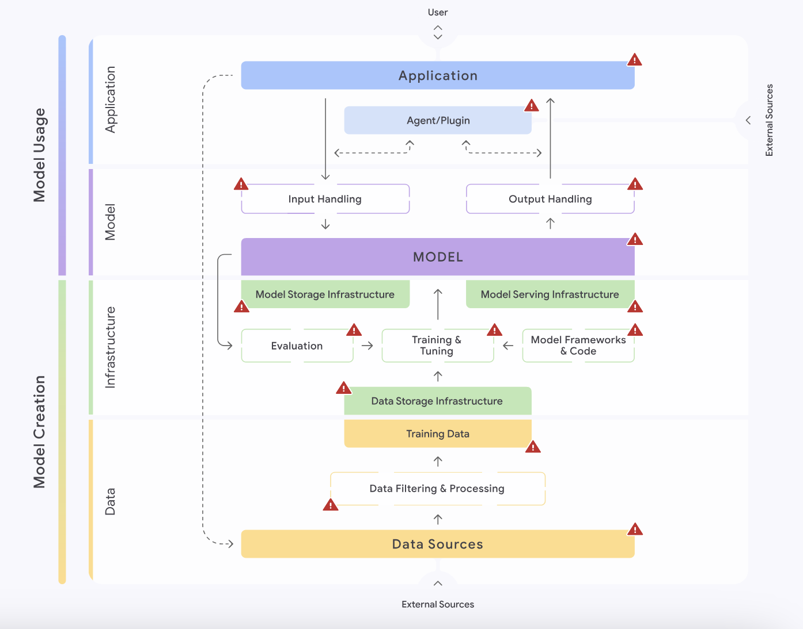

# Cadres de Sécurité Référents

> "if you want him come and claim him", Arwen, LOTR - The Followship of the Ring

## 🎯 Objectifs de cette étape
- Comprendre les cadres de sécurité existants pour les LLM

## Sommaire

- [OWASP Top 10 for LLM Applications](#owasp-top-10-for-llm-applications)
- [Mitre ATLAS, le fil d'Ariane des techniques d'attaque sur l'IA](#mitre-atlas-le-file-dariane-des-techniques-dattaque-sur-lia)
- [Soyez SAIF avec le Secure AI Framework](#soyez-saif-avec-le-secure-ai-framework)
- [Réglementation législative des LLM](#réglementation-législative-des-llm)
    - [Réglementation aux États-Unis](#réglementation-aux-états-unis)
    - [Réglementation aux États-Unis](#réglementation-aux-états-unis)
    - [Réglementation en Europe](#réglementation-en-europe)
- [Ressources](#ressources)

## OWASP Top 10 for LLM Applications

| IDENTIFIANT  | Description                                                                                                                                                                                                                    |
|--------------|--------------------------------------------------------------------------------------------------------------------------------------------------------------------------------------------------------------------------------|
| **LLM01**    | **Injection de prompt** : Les attaquants manipulent l'entrée du LLM directement ou indirectement pour provoquer un comportement malveillant ou illégal.                                                                        |
| **LLM02**    | **Gestion non sécurisée de la sortie** : La sortie du LLM est gérée de manière non sécurisée, entraînant des vulnérabilités d'injection telles que le Cross-Site Scripting (XSS), l'injection SQL ou l'injection de commandes. |
| **LLM03**    | **Empoisonnement des données d'entraînement** : Les attaquants injectent des données malveillantes ou trompeuses dans les données d'entraînement du LLM, compromettant ses performances ou créant des portes dérobées.         |
| **LLM04**    | **Déni de service du modèle** : Les attaquants fournissent au LLM des entrées provoquant une consommation excessive de ressources, causant potentiellement des perturbations du service.                                       |
| **LLM05**    | **Vulnérabilités de la chaîne d'approvisionnement** : Les attaquants exploitent les vulnérabilités dans n’importe quelle partie de la chaîne d’approvisionnement du LLM.                                                       |
| **LLM06**    | **Divulgation d’informations sensibles** : Les attaquants trompent le LLM pour qu'il révèle des informations sensibles dans sa réponse.                                                                                        |
| **LLM07**    | **Conception de plugins non sécurisée** : Les attaquants exploitent des vulnérabilités dans la sécurité des plugins LLM.                                                                                                       |
| **LLM08**    | **Accès excessif (agency)** : Les attaquants exploitent l’accès insuffisamment restreint du LLM à des systèmes ou à des actions sensibles.                                                                                     |
| **LLM09**    | **Dépendance excessive** : Une organisation dépend de manière excessive des résultats d’un LLM pour prendre des décisions critiques, exposant ainsi la sécurité à des comportements inattendus du modèle.                      |
| **LLM10**    | **Vol de modèle** : Les attaquants obtiennent un accès non autorisé au LLM, volant de la propriété intellectuelle et causant potentiellement des pertes financières.                                                           |

## Mitre ATLAS, le file d'Ariane des techniques d'attaque sur l'IA

## Soyez SAIF avec le Secure AI Framework

## Réglementation législative des LLM

Depuis ces dernières années, les législateurs de nombreux pays ont adopté de nouvelles réglementations pour lutter contre
les abus liés aux technologies d’intelligence artificielle, en particulier pour limiter la propagation de la 
désinformation et les discours de haine.

### Réglementation aux États-Unis

## Ressources

| Information                           | Lien                                                                                                                                                                                                                                                   |
|---------------------------------------|--------------------------------------------------------------------------------------------------------------------------------------------------------------------------------------------------------------------------------------------------------|
| MITRE ATLAS™ Introduction             | [https://www.youtube.com/watch?v=3FN9v-y-C-w](https://www.youtube.com/watch?v=3FN9v-y-C-w)                                                                                                                                                             |
| OWASP Top 10 for LLM Applications     | [https://owasp.org/www-project-top-10-for-large-language-model-applications/assets/PDF/OWASP-Top-10-for-LLMs-2023-v1_1.pdf](https://owasp.org/www-project-top-10-for-large-language-model-applications/assets/PDF/OWASP-Top-10-for-LLMs-2023-v1_1.pdf) |
| Secure AI Framework (SAIF)            | [https://saif.google/](https://saif.google/)                                                                                                                                                                                                           |
| Anatomy of an AI ATTACK: MITRE ATLAS  | [https://www.youtube.com/watch?v=QhoG74PDFyc](https://www.youtube.com/watch?v=QhoG74PDFyc)                                                                                                                                                             |
 
