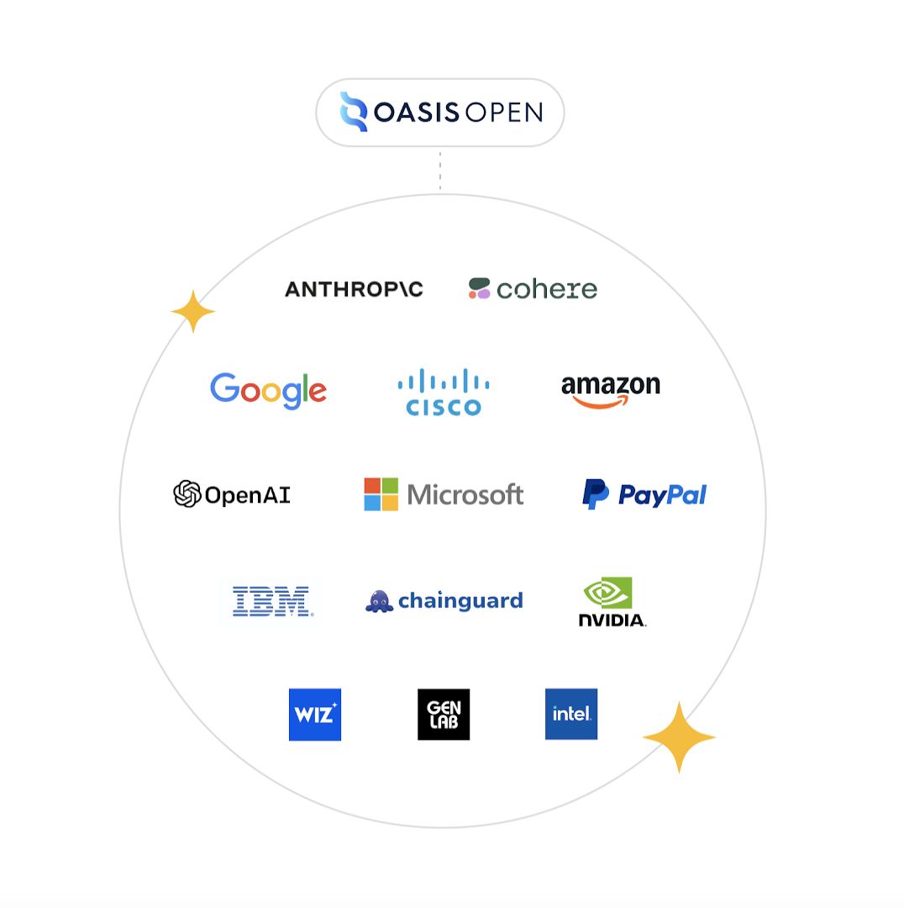

# Reference Security Frameworks

> "If you want him come and claim him", Arwen, LOTR - The Fellowship of the Ring

## 🎯 Objectives of this step

- Understand existing security frameworks for LLMs (Large Language Models)
- Identify main risks and vulnerabilities related to the use of LLMs
- Discover dedicated security frameworks and references (OWASP Top 10 LLM, SAIF, MITRE ATLAS)
- Understand legislative regulations governing LLMs (United States, European Union)
- Access resources to deepen the security of AI applications

## Table of Contents

- [OWASP Top 10 for LLM Applications](#owasp-top-10-for-llm-applications)
  - [More details](#more-details)

- [Be SAIF with the Secure AI Framework](#be-saif-with-the-secure-ai-framework)
  - [Google's Secure AI Framework (SAIF)](#googles-secure-ai-framework-saif)
  - [The four main categories of SAIF](#the-four-main-categories-of-saif)
  - [The six fundamental elements of SAIF](#the-six-fundamental-elements-of-saif)
  - [SAIF risk and control mapping](#saif-risk-and-control-mapping)
  - [Implementation and SAIF community](#implementation-and-saif-community)

- [MITRE ATLAS, the Ariadne's thread of AI attack techniques](#mitre-atlas-the-ariadnes-thread-of-ai-attack-techniques)
  - [Objective of MITRE ATLAS](#objective-of-mitre-atlas)
  - [Framework](#framework)
  - [Fundamental elements of MITRE ATLAS](#fundamental-elements-of-mitre-atlas)
  - [How to use it](#how-to-use-it)

- [Legislative regulation of LLMs](#legislative-regulation-of-llms)
  - [Issues and principles](#issues-and-principles)
    - [United States: sectoral regulation focused on freedom of expression](#united-states-sectoral-regulation-focused-on-freedom-of-expression)
    - [European Union: structured risk-based framework](#european-union-structured-risk-based-framework)
      - [Digital Services Act (DSA)](#digital-services-act-dsa)
      - [AI Act](#ai-act)
  - [Convergences and divergences](#convergences-and-divergences)

- [Next step](#next-step)
- [Resources](#resources)

## OWASP Top 10 for LLM Applications

<a href="https://genai.owasp.org/2023/10/18/llm-to-10-v1-1/" target="_blank"><em>source: genai.owasp.org</em></a>

The **OWASP Top 10 for Large Language Model Applications** is today the reference tool to list, analyze, and mitigate the main security risks specific to the use of large language models.

This collaboratively developed list is an essential guide for developers, architects, and security managers who want to integrate generative AI reliably and securely into their information systems. This ranking was created thanks to the commitment of [John Sotiropoulos](https://www.linkedin.com/in/jsotiropoulos/), project co-pilot, and [Ads Dawson](https://www.linkedin.com/in/adamdawson0/), technical lead in charge of coordinating the writing of the repository's technical aspects.

Here is a summary of the OWASP Top 10 for LLM Applications 2025:

| ID         | Description                                                                                                                                                                   |
|------------|-------------------------------------------------------------------------------------------------------------------------------------------------------------------------------|
| **LLM01**  | **Prompt Injection**: Attackers manipulate LLM input directly or indirectly to cause malicious or illegal behavior.                                                           |
| **LLM02**  | **Sensitive Information Disclosure**: Attackers trick the LLM to reveal sensitive information in its response.                                                                |
| **LLM03**  | **Supply Chain Vulnerabilities**: Attackers exploit vulnerabilities in any part of the LLM's supply chain.                                                                    |
| **LLM04**  | **Data and Model Poisoning**: Attackers inject malicious or misleading data into the LLM training data, compromising performance or creating backdoors.                       |
| **LLM05**  | **Unsecure Output Handling**: LLM output is handled insecurely, leading to injection vulnerabilities such as Cross-Site Scripting (XSS), SQL injection, or command injection. |
| **LLM06**  | **Excessive Access (Agency)**: Attackers exploit insufficiently restricted LLM access to sensitive systems or actions.                                                        |
| **LLM07**  | **System Prompt Leakage**: Sensitive information contained in system prompts is accidentally disclosed.                                                                       |
| **LLM08**  | **Vector and Embedding Vulnerabilities**: Exploitation of weaknesses in vector and embedding management in RAG systems, causing data leakage or alteration.                   |
| **LLM09**  | **Disinformation**: The LLM generates false or misleading information, causing security and reputational risks.                                                               |
| **LLM10**  | **Unbounded Consumption**: Attacks exploit excessive resource consumption, causing denial of service or financial costs.                                                      |

### More details

  
Prompt Injection (LLM01)

Prompt injection is a security vulnerability that occurs when a malicious user manages to manipulate the input instructions given to a language model (LLM), causing it to adopt unexpected or undesired behavior.

Some manipulations may appear harmless—e.g., diverting a technical support chatbot to provide cooking recipes—but others can have much more serious consequences. This technique can be exploited to encourage the LLM to produce false information, hate speech, or harmful or even illegal content.

In some cases, prompt injection may also allow an attacker to extract sensitive data previously provided to the model, thus compromising the confidentiality of the processed information.

  
Sensitive Information Disclosure (LLM02)

Language models (LLMs) can unintentionally disclose confidential data in their responses. Such exposure can lead to unauthorized access to sensitive information, privacy breaches, or security vulnerabilities. It is essential to strictly restrict access to information that the LLM is authorized to consult. 

This is especially important when the model is used to process sensitive or strategic data, such as customer information. In these cases, requests to the LLM should be subject to rigorous access controls to limit data leakage risk.

If the LLM was trained or fine-tuned using a custom dataset, it is crucial to bear in mind that it can be manipulated (for example, by prompt injection attacks) to reveal elements of this training data. Therefore, any sensitive information included in the training corpus must be carefully identified, assessed according to its criticality, and protected accordingly.

Furthermore, sensitive data provided to the LLM via user prompts may be exposed by injection attacks (see LLM01), even if the model was explicitly requested to keep this information confidential. This highlights the need for security measures adapted to each contact point between the user and the model.

 
 

  
Supply Chain Vulnerabilities (LLM03)

Supply chain vulnerabilities in the context of LLMs concern all elements involved in their development or deployment. This notably includes datasets used for training (see LLM03), pre-trained models provided by third parties, as well as plugins, extensions, or other systems interacting with the LLM (cf. LLM07).

The impact of these vulnerabilities can vary considerably, ranging from simple malfunctions to critical consequences. One of the most common scenarios is the leakage of sensitive data or disclosure of intellectual property, compromising the confidentiality or strategic assets of the organization.

  
Data and Model Poisoning (LLM04)

The quality and performance of a language model (LLM) largely depend on the data used during its training phase. Training Data Poisoning consists of manipulating all or part of these data to introduce deliberate biases, causing the model to produce incorrect or malicious results.

Depending on the compromised LLM's use, consequences can range from loss of credibility to critical security vulnerabilities, especially if the model generates code reused in other software components.

To succeed in a training data poisoning attack, an attacker must first have access to the data corpus used to train the model. When training relies on publicly accessible data (such as web content), it is crucial to clean and verify their integrity to eliminate any source of bias or manipulated content.

Mitigation strategies include:
- Fine and regular verification of the training data supply chain
- Assessment of the legitimacy and provenance of sources
- Implementation of filters capable of identifying and excluding incorrect or malicious data

In short, rigorous attention to training data quality is essential to guarantee reliable and ethical behavior of LLMs.

 
 

Unsecure Output Handling (LLM05)

Unsecure output handling refers to the lack of proper validation, sanitation, and control of the responses generated by the LLM before their transmission to other systems or the end user. Since model outputs can be influenced by malicious inputs, this amounts to granting indirect access to additional functionalities, potentially causing serious vulnerabilities.

This poor handling exposes the system to attacks such as Cross-Site Scripting (XSS), Cross-Site Request Forgery (CSRF), Server Side Request Forgery (SSRF), privilege escalation, or even remote code execution (RCE) on backend systems processing the outputs.

Common causes include lack of appropriate encoding of outputs, absence of context-specific filtering (HTML, SQL, system commands), and limited monitoring of abnormal output behaviors.

To prevent these flaws, it is recommended to:

- Treat LLM outputs as coming from an untrusted user (zero-trust model).

- Rigorously validate and sanitize all output before use or display.

- Apply specific contextual encoding (HTML, JavaScript, SQL, etc.).

- Use strict security policies, such as Content Security Policies (CSP) for the web.

- Introduce monitoring and alert mechanisms for suspicious or abnormal outputs.

In summary, unsecure output handling is a critical vulnerability that can compromise the overall security of the application by allowing unwanted executions and attacks via LLM responses.

 

Excessive Access (Agency) LLM06

Excessive access (agency) is a major vulnerability in applications using large language models (LLMs), where the model or LLM agent has overly broad privileges or authorizations, allowing it to interact with sensitive systems, databases, or functions beyond what is strictly necessary.

This overexposure can allow an attacker, by manipulating the model through malicious prompts or requests, to perform unauthorized actions such as modifying, stealing, or deleting data, triggering critical operations, or extending control in the target environment.

Typical causes include poor permission management, insufficient isolation between automated functions, or an overly permissive agent architecture, for example with LLMs acting as autonomous agents capable of executing system commands without supervision.

To mitigate this risk, it is recommended to:

- Apply the principle of least privilege: strictly limit LLM access and capabilities to what is essential.

- Implement granular access controls and verify every LLM request before execution.

- Employ manual or automatic validation mechanisms (human-in-the-loop) for any sensitive operation.

- Functional segmentation and strict isolation of LLM agents when multiple are used.

- Actively monitor interactions and detect any abnormal or suspicious activity.

In short, excessive access is a critical attack vector making an LLM potentially capable of causing significant damage and requires strong governance and secure design from the development phase.

 
 

System Prompt Leakage (LLM07)

System prompt leakage refers to the vulnerability where internal instructions or system prompts used to guide the behavior of a large language model (LLM) are accidentally exposed or disclosed to unauthorized users. These system prompts often contain sensitive information such as access keys, security parameters, business rules, or filtering controls, which should not be visible.

The real vulnerability lies not so much in the disclosure itself but in the fact that this information is used to delegate access, privilege, or security controls to the model itself. Leakage therefore allows attackers to bypass these controls and perform unauthorized actions by manipulating the model.

Recommended preventive measures include:

- Separating sensitive information from system prompts by storing them in secure independent environments inaccessible directly to the LLM.

- Not relying on system prompts as the sole security mechanism; implement external controls, such as guardrails inspecting model outputs.

- Strictly apply the principle of least privilege in configuring agents or systems integrated with LLMs.

- Use multiple distinct LLM agents, each with adapted and limited access to their tasks to minimize risks.

In short, system prompt leakage is a critical vulnerability because it compromises fundamental security mechanisms, exposing LLM applications to widespread attacks such as jailbreak, data disclosure, or malicious actions.

Vector and Embedding Vulnerabilities (LLM08)

Vector and embedding vulnerabilities (LLM08) concern security flaws related to how LLMs process, store, and use numerical representations (vectors, embeddings) of data. These vectors allow the model to quickly retrieve information and provide contextual responses, notably in retrieval augmented generation (RAG) systems.

Major risks include unauthorized access to sensitive data contained in vectors, information leakage between different users or contexts (in a multi-tenant environment), as well as embedding inversion attacks that reconstruct original data from vectors. Furthermore, poisoning of embeddings can manipulate model outputs, affecting the reliability and security of responses.

To reduce these risks, it is essential to apply strict access and authentication controls to vector databases, validate the source and integrity of inserted data, classify and separate data according to access scopes, and continuously monitor retrieval activities to detect anomalies.

These vulnerabilities represent a subtle but critical threat as they can create invisible backdoors, durably integrated into the internal functioning of the model, escaping classical protections based on prompts or outputs.

 
 

Misinformation (LLM09)

Misinformation refers to the ability of language models (LLMs) to generate false, inaccurate, or misleading content that may appear credible at first glance. This vulnerability often stems from errors, biases, or limitations in training data, where the model "guesses" or hallucinates answers even in the absence of confirmed facts.

This misinformation can lead to serious risks, such as security breaches, damage to organizations' reputations, or legal liabilities if decisions are made based on erroneous information. For example, an LLM could provide an incorrect emergency number in a critical context, potentially endangering users' lives.

To limit this risk, it is advised to use reliable and validated sources for training, regularly verify data accuracy, integrate real-time fact-checking APIs, and filter or validate model outputs before publication or use. Human-in-the-loop control is also recommended to approve results in high-risk contexts.

Misinformation is a key issue for trust in LLM-based systems and requires approaches combining technical measures, processes, and user awareness.

Unbounded Consumption (LLM10)

Unbounded consumption refers to a vulnerability where an application using a large language model (LLM) allows users to generate excessive and uncontrolled queries or inputs. This leads to abusive use of computational resources, such as memory and CPU, potentially causing denial of service (DoS), service degradation, or very high financial costs.

Attackers exploit this flaw by submitting long or numerous inputs, triggering heavy processing, often in cloud environments, which can saturate resources and make the service unavailable to legitimate users. This excessive consumption can also lead to indirect theft of intellectual property by extraction or cloning of the model.

To mitigate this risk, it is recommended to impose strict limits on request size and number, continuously monitor and log resource usage, implement rigorous access controls, as well as load balancing and scaling strategies to manage usage peaks. The system should be designed to degrade performance gracefully in case of overload rather than fail completely.

In short, unbounded consumption is a major risk since it directly impacts availability, economic security, and resilience of LLM-based applications.

## Be SAIF with the Secure AI Framework

### Google's Secure AI Framework (SAIF)

The **Secure AI Framework (SAIF)** from **Google** is a conceptual framework developed to ensure security throughout the lifecycle of artificial intelligence systems, from data collection to model deployment. It was designed to address major risk management, security, and privacy challenges specific to AI and machine learning models. **SAIF** aims to make these systems "secure by default" from their initial implementation by integrating essential protective measures from the design phase and throughout the development process until deployment in production.

**SAIF** aligns with **Google**’s broader approach to responsible AI, guided by principles such as:
 - security
 - fairness
 - interpretability
 - privacy protection. 

The framework provides concrete standards and controls for building, evaluating, and deploying AI systems, embedding security in a cross-cutting manner.

### The Four Main Categories of SAIF

SAIF structures AI secure development around four major axes, each associated with several key technical components:

 - **Data**: concerns data sources, filtering, and preparation processes, as well as the datasets used for model training.
 - **Infrastructure**: includes hardware, hosting security, frameworks and code necessary for training, data and model storage, as well as deployment (Model Serving).
 - **Model**: includes the model itself (code and weights), input handling to protect against malicious inputs, and output handling to prevent data exposure or unexpected behaviors.
 - **Application**: relates to the application suite interacting with the model, including agents or plugins that can present additional risks.

### The Six Fundamental Elements of SAIF

SAIF is built around six fundamental elements that must be continuously implemented:

1. **Establish strong security foundations for the AI ecosystem**: apply traditional security principles to the entire AI ecosystem, notably for infrastructure, source codes, and software supply chain.
2. **Extend detection and response to include AI in the organization's threat landscape**: monitor AI system inputs/outputs and integrate AI into traditional incident detection and response systems.
3. **Automate defenses to keep up with evolving threats**: leverage AI innovations to counter large-scale attacks and automate protection.
4. **Harmonize controls at the platform level**: ensure consistency of security policies and controls across all AI services and platforms.
5. **Adapt controls to create rapid feedback loops**: quickly adjust and evolve security mechanisms during AI deployment or evolution.
6. **Contextualize risks within business processes**: integrate AI risk analysis into the organization's overall risk management.

### SAIF Risk and Control Mapping

SAIF provides access to a detailed mapping of AI-specific risks, such as:

- data poisoning,
- unauthorized data use,
- code or model weight alteration,
- model exfiltration,
- denial of service attacks,
- sensitive data disclosure or inference, etc.

<a href="https://saif.google/secure-ai-framework/saif-map" target="_blank"><em>source: saif.google</em></a>

For each risk, controls and mitigation measures are proposed, along with designation of responsibility (model creator or model consumer). Examples include:

- Input/output validation and sanitization
- Adversarial training and testing
- Access management, logging, continuous monitoring

The SAIF mapping allows identifying where each risk arises (introduction), where it can be exploited (exposure), and at which level it can be mitigated (associated element or control).

### Implementation and SAIF community

**Google** provides **SAIF** as a reference point for enterprises, governments, and organizations with a resource center (saif.google) offering self-assessment guides, security controls, and a community space. Google works in coalition ([The Coalition for Secure AI](https://www.coalitionforsecureai.org/)) with major industry players such as **Amazon**, **Cisco**, **IBM**, **Intel**, **Microsoft**, **NVIDIA**, **OpenAI**,... to advance adoption of this framework, aiming to secure AI for the benefit of all.

  
The Coalition for Secure AI

## MITRE ATLAS, the Ariadne’s Thread of AI Attack Techniques

<a href="https://www.riskinsight-wavestone.com/2024/11/lutilisation-pratique-du-cadre-atlas-de-mitre-pour-les-equipes-du-rssi/" target="_blank"><em>source: riskinsight-wavestone.com</em></a>

### Objective of MITRE ATLAS

The **MITRE ATLAS** (Adversarial Tactics, Techniques, and Common Knowledge for AI Systems) is an international reference framework designed to identify, classify, and mitigate adversarial threats targeting AI and machine learning systems.

The objective of ATLAS is to provide a structured knowledge base on tactics and techniques employed by attackers against AI, thus facilitating proactive protection of these systems and optimizing their security within the enterprise ecosystem.

### Framework

The [**MITRE ATLAS**](https://atlas.mitre.org/) heavily draws from the well-known [**MITRE ATT&CK**](https://attack.mitre.org/), used in traditional cybersecurity to map threats and adversarial actions on information systems. ATLAS applies this approach to AI, focusing on risks, vulnerabilities, and attack techniques specific to AI and machine learning technologies.

### Fundamental Elements of MITRE ATLAS

ATLAS is structured around several key elements:

- **Tactics**: The high-level goals pursued by attackers (e.g., evasion, training data compromise, initial access).

- **Techniques**: Concrete methods to achieve these goals (e.g., data poisoning, model extraction, prompt injection).

- **Procedures**: Real-world examples and use cases illustrating how these techniques have been applied in practice.

- **Case Studies**: Documentation of effective attacks on AI systems to continuously enrich the knowledge base.

### How to Use It

**MITRE ATLAS** is designed for use by security professionals, researchers, and developers. It should be seen as a structured dashboard for AI security teams.

Users can navigate the repository to identify threats relevant to their context, such as:

- **Threat Mapping**: Security teams model risks and threats weighing on their AI system using the ATLAS matrix to anticipate possible attack techniques.

- **Defensive Coverage Assessment**: Using tools like **ATLAS Navigator**, it is possible to visualize which attack techniques are already covered by existing controls, which require adjustments, or where new AI-specific controls need to be created.

- **Incident Detection and Response**: When an incident involving an AI system occurs, ATLAS allows tracing the attack flow, identifying used tactics and techniques, and targeting technical and organizational response.

- **Training and Awareness**: **ATLAS** serves as a support to train data scientists, AI engineers, and SOC (Security Operations Center) teams on emerging AI threats, paving the way for close interfunctional collaboration between business and security.

- **Development of Defensive Use Cases**: The techniques documented in ATLAS serve as a basis for creating detection rules, penetration test scenarios, and mitigation plans specific to AI systems.

## Legislative regulation of LLMs

Between 2013 and 2023, American companies attracted a volume of private capital more than six times greater than that invested in European companies, thereby fostering an unparalleled ecosystem of innovation in the field of artificial intelligence.

For comparison, **American** companies raised approximately **$486.1 billion** in private funding during this period, compared to only **$75.7 billion** for their **European** counterparts.

  
Graph comparison: 10 years of AI investments in the United States and the European Union.

Thus, in recent years, many countries have implemented new regulations to address issues related to AI technologies, particularly to curb the spread of disinformation and hate speech. Here is an overview of the approaches adopted by the United States and the European Union regarding the regulation of large language models (LLMs).

### Issues and principles

- **Balance of responsibility/innovation:** Regulating LLMs requires maintaining a proper balance between holding actors (developers, deployers, users) accountable and preserving innovation. LLMs offer major benefits (education, accessibility, creativity) but also entail risks, such as generating harmful content.

- **Responsibility definition:** Identifying those responsible for content generated by LLMs remains a challenge. Can responsibility be assigned to the developer, the deployer, or the user?

- **Respect for fundamental rights:** Combating abuse should not compromise human rights such as freedom of expression. Regulations should aim to protect without imposing excessive censorship.

## United States: Sectoral Regulation Focused on Freedom of Expression

- **Freedom of Expression:** In the U.S., the dissemination of false or controversial information, except in cases of defamation, incitement to violence, or fraud, remains protected by the First Amendment, making it difficult to implement substantial measures against disinformation.

- **Take It Down Act:** This recent federal legislation targets the spread of abusive content on the internet, especially deepfakes and non-consensual intimate images, including if generated by AI. It requires platforms to implement rapid reporting and removal obligations under penalty of administrative sanctions. The law fills a significant legal gap concerning deepfakes.

- **Platform obligations:** Social networks and hosting sites must remove reported illegal content quickly. Non-compliance can lead to significant sanctions.

- **Best practices and self-regulation:** Public organizations such as [NIST (National Institute of Standards and Technology)](https://www.nist.gov/) recommend risk management practices (AI RMF). Additionally, the [Federal Trade Commission (FTC)](https://www.ftc.gov/) can act against deceptive commercial practices involving AI.

## European Union: structured risk-based framework

European regulation revolves around two main texts:

### Digital Services Act (DSA)

- **General obligations:** Mechanisms for reporting and removing illegal content; right of appeal for users in case of wrongful removal.

- **Broad scope:** Applies to all digital service providers operating in the EU, even if they are based abroad.

- **Recurring risk assessments:** For major players, the DSA imposes regular assessments on issues such as disinformation. Platforms must act effectively to mitigate these risks (algorithm modifications, increased transparency, etc.).

- **Enhanced transparency and fundamental rights:** Protection against harmful content, respect for privacy and freedom of expression, clear publication of moderation and advertising policies.

### AI Act

- An approach based on 4 risk levels:

  - **Unacceptable risk:** Prohibited systems (e.g., social scoring, mass manipulation).
  - **High risk:** Critical sectors (health, education, security). Strict obligations include risk management, data governance, and human oversight.
  - **Limited risk:** Systems interacting with the public or generating content, like LLMs. Requirements include transparency (disclose if content is AI-generated), documentation, and measures to prevent misuse.
  - **Minimal risk:** Simple applications such as anti-spam filters, largely unregulated.

- **Specific innovations:** The AI Act includes particular obligations for general-purpose AI models posing significant systemic risks (massive computational capacities).

- **Penalties and controls:** Violators face increased oversight and substantial financial sanctions.

### Convergences and Divergences

The following table summarizes the differences and similarities between the regulatory approaches of the U.S. and the EU regarding LLMs:

| Points                             | United States                                                                                        | European Union                                                                                           |
|------------------------------------|------------------------------------------------------------------------------------------------------|----------------------------------------------------------------------------------------------------------|
| **Core Priority**                  | Freedom of expression preserved, targeted interventions on specific issues (deepfakes, fraud).       | Whole lifecycle approach based on risk level.                                                            |
| **Regulation Philosophy**          | Case-by-case focus and defense of the First Amendment.                                               | Preventive and systemic, with transparency, documentation, and risk management at every stage.           |
| **Responsibility**                 | Targeted obligations on certain platforms; variable sanctions and standards across states and cases. | Clear and harmonized responsibility for platforms and providers, structured sanctions regime.            |
| **Transparency and Documentation** | Limited requirements in specific cases (deepfakes, fraud); no comprehensive framework.               | Strong transparency, documentation, public access to information for high-risk systems.                  |
| **Sanction Harmonization**         | Fragmented, with significant variations across federal states and occasional federal interventions.  | Harmonized sanctions, regularly strengthened and unified at the EU level.                                |

This opposition illustrates the diversity of regulatory strategies, oscillating between respect for freedoms and effective prevention of technological misuse.

## Next Step

- [Step 5](step_5.md)

## Resources

| Information                                                               | Link                                                                                                                                                                                                                                                                                                                                                         |
|---------------------------------------------------------------------------|--------------------------------------------------------------------------------------------------------------------------------------------------------------------------------------------------------------------------------------------------------------------------------------------------------------------------------------------------------------|
| OWASP Top 10 for LLM Applications  2025                                   | [https://owasp.org/www-project-top-10-for-large-language-model-applications/assets/PDF/OWASP-Top-10-for-LLMs-v2025.pdf](https://owasp.org/www-project-top-10-for-large-language-model-applications/assets/PDF/OWASP-Top-10-for-LLMs-v2025.pdf)                                                                                                               |
| Explained: The OWASP Top 10 for Large Language Model Applications         | [https://www.youtube.com/watch?v=cYuesqIKf9A](https://www.youtube.com/watch?v=cYuesqIKf9A)                                                                                                                                                                                                                                                                   |
| Model theft: Meta LLaMA leak                                              | [https://learn.snyk.io/lesson/model-theft-llm/](https://learn.snyk.io/lesson/model-theft-llm/)                                                                                                                                                                                                                                                               |
| Secure AI Framework (SAIF)                                                | [https://saif.google/](https://saif.google/)                                                                                                                                                                                                                                                                                                                 |
| Google launches a framework to secure AI models                           | [https://www.lemondeinformatique.fr/actualites/lire-google-lance-un-framework-pour-securiser-les-modeles-d-ia-90694.html](https://www.lemondeinformatique.fr/actualites/lire-google-lance-un-framework-pour-securiser-les-modeles-d-ia-90694.html)                                                                                                           |
| Presentation on security in the AI world                                  | [https://www.cloudskillsboost.google/paths/1283/course_templates/1147?locale=fr](https://www.cloudskillsboost.google/paths/1283/course_templates/1147?locale=fr)                                                                                                                                                                                             |
| What Is Google's Secure AI Framework (SAIF)?                              | [https://www.paloaltonetworks.com/cyberpedia/google-secure-ai-framework](https://www.paloaltonetworks.com/cyberpedia/google-secure-ai-framework)                                                                                                                                                                                                             |
| Secure AI Framework Approach                                              | [https://kstatic.googleusercontent.com/files/00e270b1cccb1f37302462a162c171d86f293a84de54036e0021e2fe0253cf05623bae2a62751b0840667bc6c8412fd70f45c9485972dc370be8394fae922d31](https://kstatic.googleusercontent.com/files/00e270b1cccb1f37302462a162c171d86f293a84de54036e0021e2fe0253cf05623bae2a62751b0840667bc6c8412fd70f45c9485972dc370be8394fae922d31) |
| Securing the AI pipeline                                                  | [https://cloud.google.com/blog/topics/threat-intelligence/securing-ai-pipeline/?hl=en](https://cloud.google.com/blog/topics/threat-intelligence/securing-ai-pipeline/?hl=en)                                                                                                                                                                                 |
| Announcing the Coalition for Secure AI (CoSAI) and founding organizations | [https://blog.google/technology/safety-security/google-coalition-for-secure-ai/](https://blog.google/technology/safety-security/google-coalition-for-secure-ai/)                                                                                                                                                                                             |
| MITRE ATLAS                                                               | [https://atlas.mitre.org/](https://atlas.mitre.org/)                                                                                                                                                                                                                                                                                                         |
| Anatomy of an AI Attack: MITRE ATLAS                                      | [https://www.youtube.com/watch?v=QhoG74PDFyc](https://www.youtube.com/watch?v=QhoG74PDFyc)                                                                                                                                                                                                                                                                   |
| Introduction to MITRE ATLAS                                               | [https://www.youtube.com/watch?v=3FN9v-y-C-w](https://www.youtube.com/watch?v=3FN9v-y-C-w)                                                                                                                                                                                                                                                                   |
| Practical use of the MITRE ATLAS framework for security teams             | [https://www.riskinsight-wavestone.com/2024/11/lutilisation-pratique-du-cadre-atlas-de-mitre-pour-les-equipes-du-rssi/](https://www.riskinsight-wavestone.com/2024/11/lutilisation-pratique-du-cadre-atlas-de-mitre-pour-les-equipes-du-rssi/)                                                                                                               |

